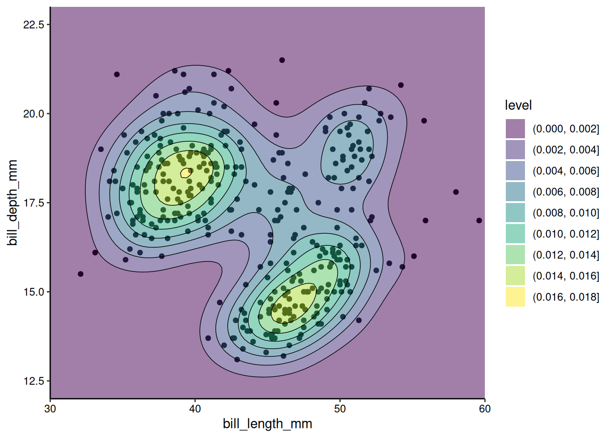

# A section title

## Markdown formatting

<br>

I increased the space between the title and this line with `<br>`.

Some text **formatted** with *markdown*.

## Lists

<br>

A numbered list:

1. hello
   a. there
1. hi

An unnumbered list:

- hello
  - again
- hi

## Lists

<br>

List items can appear incrementally by wrapping the list in `::: {.incremental}`:

::: {.incremental}
1. hello
   a. there
1. hi
:::

## Pauses

<br>

Any content can be shown incrementally by using `. . .` (the space between each dot is important, `...` wouldn't work).

. . .

<br>

This appears when advancing the slides.

. . .

<br>

Same.

## Center text

<br>

Center text with `<center> my text </center>`:

<br>

<center>
This is centered text.

Another centered sentence.
</center>

## Equations

<br>

Some equation using the LaTeX syntax, either inline with `$ my equation $`, like $x + 1 = y$,

<br>

or on its own line with `$$ my equation $$`, like this:

$$x + 1 = y$$

## Images

<br>

Use `` to add an image:



## Images

<br>

Pass options with

`{some options here}`

e.g. `{width="25%" height="25%"}`:

{width="25%" height="25%"}

## Code formatting

<br>

We can write inline code with one backtick on each side, like `mean(x)`.

<br>

We can write code chunks with three backticks and the name of the language, like:

```{r}
mean(x)
```

## Code evaluation

<br>

We can pass chunk options with `#|` in each chunk to control whether the code should run (`eval`), whether the code should be shown (`echo`), and [more](https://quarto.org/docs/computations/r.html#chunk-options).

<br>

Below, I hide the original code but show its output:

```{r}
#| echo: false
#| eval: true

x <- 1:5
mean(x)
```

## Highlight lines of code

<br>

Use `code-line-numbers` to highlight lines of code.

Using `#| code-line-numbers: "1|2-5|6|"` will highlight the first line, then lines 2-5, then line 6, and finally the entire block:

```{r}
#| code-line-numbers: "1|2-5|6|"

x <- 1
y <- paste(
  "hello there",
  "how are you?"
)
z <- 2
```

## Callouts

<br>

We can show callouts with `::: {.callout-note}` + `:::` to mark the end of the callout:

::: {.callout-note}
Hello, this is a note.

See more callout options here: [https://quarto.org/docs/authoring/callouts.html](https://quarto.org/docs/authoring/callouts.html)
:::

This is a `.callout-warning`:

::: {.callout-warning}
Hello, this is a warning.
:::

## Callouts

<br>

Use a pause in callouts to wait before showing a solution:

::: {.callout-note}
What is 1 + 1?

::::: {.callout-caution collapse="true" appearance="simple" icon="false"}
##### Solution

. . .

```{r}
#| eval: true

1 + 1
```
:::::
:::

## Write on several <br>columns

<br>

Use this to write on multiple columns (result next slide):

```
:::: {.columns}

::: {.column width="40%"}
Left column
:::

::: {.column width="60%"}
Right column
:::

::::
```

## Write on several <br>columns

<br>

::: {.columns}
::::: {.column width="40%"}
Left column
:::::

::::: {.column width="60%"}
Right column
:::::
:::

## Write on several <br>columns

<br>

You can put any content in each column, such as plots:

<br>

::: {.columns}
::::: {.column width="40%"}
Left column
:::::

::::: {.column width="60%"}
```{r}
#| eval: true

plot(iris)
```
:::::
:::

## The end

<br>
<br>
<br>

[https://quarto.org/docs/presentations/revealjs/](https://quarto.org/docs/presentations/revealjs/)
