::: {.callout-note}
To do this exercise you will need to install and setup GitHub Desktop. Follow the instructions [here](index.qmd#prerequisites).
:::

In this exercise you will initialize a git repository on your computer and explore various git commands with it.

### I. Initializing and adding files

1.  If it's not already open, open GitHub Desktop.

1.  If this is your first time using GitHub Desktop you should see a screen with "Let's get started!" at the top:

    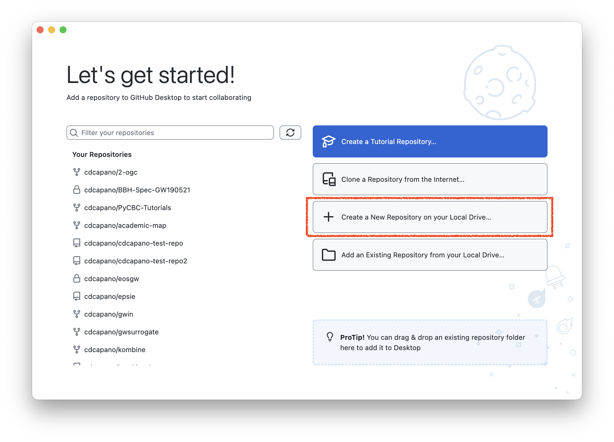

    Click the button titled "Create a New Repository on your Local Drive..."

1.  In the Create a New Repository window, enter `test-git-repo` in the "Name" field, then click "Create Repository". You do not need to fill out any of the other fields.

    ::: {.callout-note}
    ## Note
    By default this will create a local repository in your Documents/GitHub folder. You can change where the repo is located by clicking "Choose". For this tutorial, let's stick with the default.
    :::

1.  You will see a window that has "No local changes" at the top:

    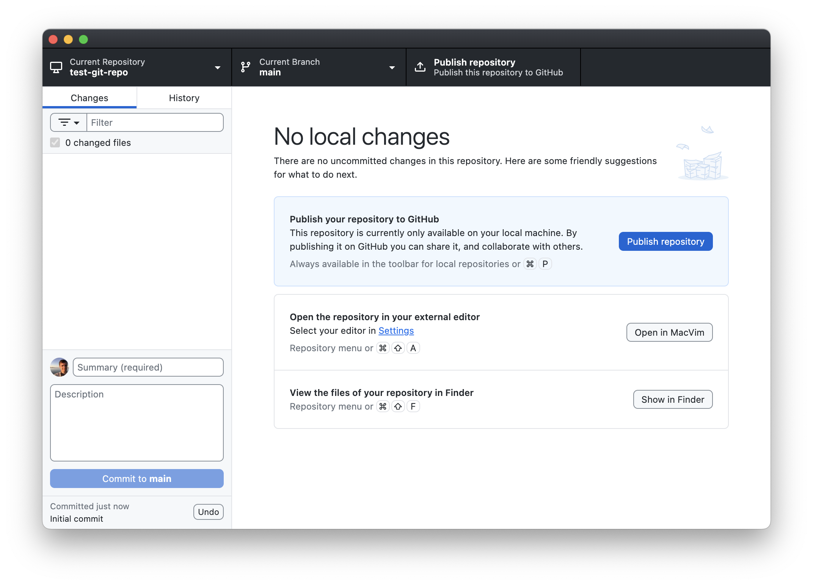

    In the upper left you will see "Current repository" with "test-git-repo" underneath it, indicating that you are currently looking at your test-git-repo. This is how you will interact with your new repository!

    Note that your repository is a folder on your computer, just like any others. You can see this if you click on the button labelled "Show in Explorer" (on Windows) / "Show in Finder" (on a Mac). At the moment, there are no files in your repository, although there is a *hidden* folder called `.git` and a *hidden* file called `.gitattributes`. **You never touch these files**; they are what `git` use to keep track of the contents of this folder. These are what make this folder a repository.

    ::: {.callout-tip}
    A local Git repository is a folder on your computer that you have told the application `git` to keep track of. Any folder can be made into a git repository!
    :::

1.  Let's add some files to your new repository for git to track. In the following steps, we'll pretend that we're a writer working on a script for a new movie. We're going to use a simple text editor to create a file called `story.txt`. To do that:

    * **If you're on Windows:**
        a. Open Notepad. This will open a new untitled file.
        a. Click File -> Save As...
        a. Navigate to your repository's directory. If you kept the default path when creating the repository, this should be `PC > Documents > GitHub > test-git-repo`. If you're not certain, you can verify by clicking on the "Show in Explorer" button in GitHub Desktop.
        a. In the "File name" field enter `story.txt` then click "Save".

    * **If you're on MacOS:**
        a. Open TextEdit and click "New Document". This will open a new untitled file.
        a. Select Format -> "Make Plain Text". (We need to do this to get the desired file extension.)
        a. Click File -> Save...
        a. In the "Save As" field type `story.txt`.
        a. In the "Where" field navigate to your repository's directory. If you kept the default path when creating the repository, this should be `Documents/GitHub/test-git-repo`. If you're not certain, you can verify by clicking on the "Show in Finder" button in GitHub Desktop.
        a. Click "Save".

1.  Now let's write our story! Use your text editor to add following to `story.txt`:

    ```
    Once upon a time, in a land far,
    far away...
    ```

    ::: {.callout-warning}
    Type the lines in exactly as they appear above: add a new line after the first "far,". For reasons that will become clear below, it's important that the "far away..." is on a separate line.
    :::

1.  Save your changes by clicking File -> Save, or by using the keyboard shortcut <kbd>Ctrl</kbd>+<kbd>S</kbd> (on Windows) / <kbd>&#8984;</kbd>+<kbd>S</kbd> (on Mac).

1.  Now go back to GitHub Desktop. You'll notice that it has changed from "No local changes" to showing a "Changes" tab with `story.txt` listed with its contents: 

    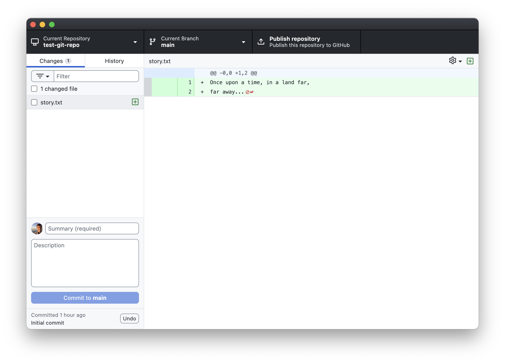

    `git` knows you have a file in the directory called `story.txt`, but it isn't tracking it yet!

1.  Let's tell `git` to start tracking `story.txt` by making a *commit*. If it isn't already, click the box next to "1 changed file". When you do, you'll notice that the "Summary (required)" box automatically changes to "Create story.txt":

    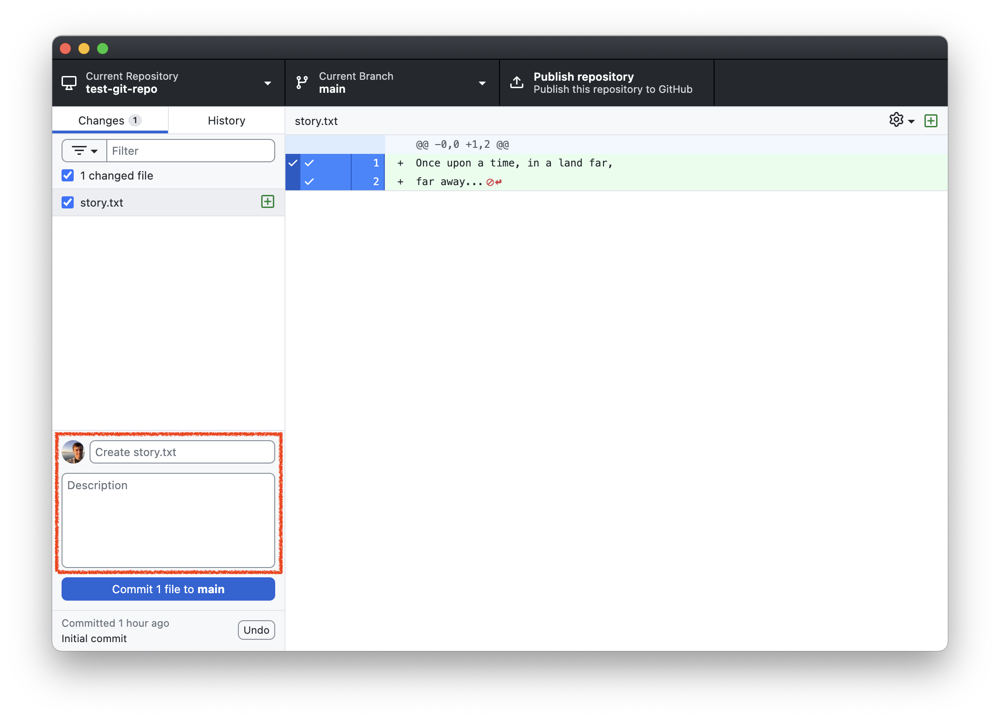

    The summary box and the optional "Description" box below constitute the *commit message*. This is text that will be added to the commit describing what was done. In this case, GitHub Desktop automatically provides a default message of "Create story.txt". That's a good description of what we've done, so let's keep it.

1.  Now click the "Commit 1 file to main" button. When you do, the window will automatically change back to "No local changes". Congratulations, you've made your first `git` commit!

    ::: {.callout-tip}
    ## What happens when you commit changes?
    A commit creates a snapshot of the files you committed. Every commit has a commit message, an author, and a unique hash identifying that change. Git keeps a *history* of all commits made in a repository. From now on, you can go back and view the previous state of a file at different commit points. This is known as *version control*.
    :::

1.  You can view the history of your commits by clicking on the "History" tab:

    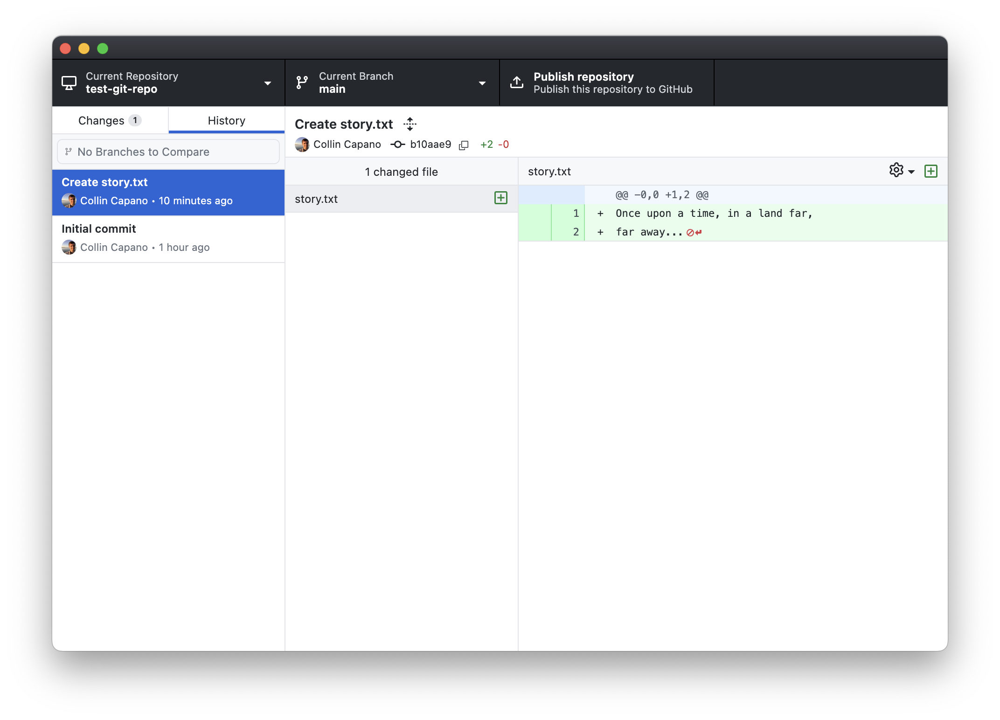

    In this case, there are two commits: an initial commit that was created by GitHub Desktop when the repository was created, and the commit you just made to create `story.txt`.


### II. Making changes to files

1.  You're not happy with your story opening. You don't want to write fairy tales, you want to write Sci-fi! Go back to your text editor `story.txt` and change the line `Once upon a time, in a land far,` to `A long time ago in a galaxy far,` so that your file now reads:

    ```
    A long time ago in a galaxy far,
    far away...
    ```
    
    Much better. Save the changes to the file.

1.  Go back to GitHub Desktop. Notice that a yellow box with a dot has appeared next to `story.txt`. If you click on story, you should now see a *diff* that shows what lines have changed in `story.txt`:

    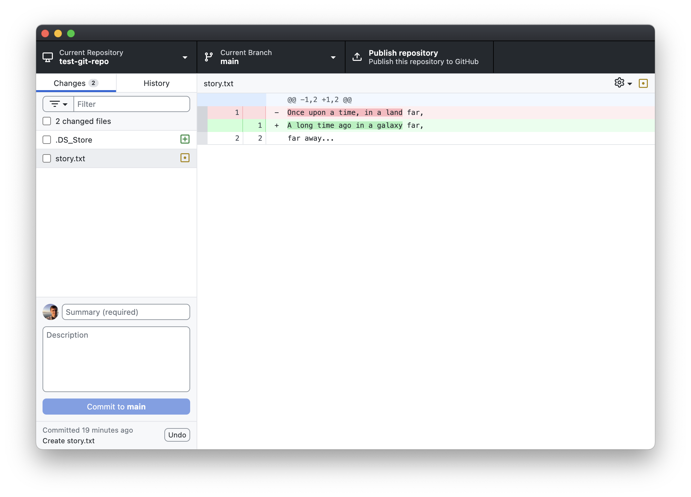

    ::: {.callout-warning}
    ## Those pesky .DS_Store files on MacOS
    At some point Mac users will notice a file called `.DS_Store` appears in their repo, as it did for me in the screen shot above. This is a hidden file that MacOS automatically creates in every folder for indexing purposes. **Do not commit this file to your repository!** It's not something you want to track. For now, just ignore it. Below we provide instructions on how to permanently ignore files like these in your repository.

    Windows users: carry on.
    :::

    
1.  The yellow box next to `story.txt` means that git recognizes that `story.txt` has changed, *but your changes have not been committed yet.* If you go to the History tab, you'll see that there are still only two commits. If you click on the "Create story.txt" commit, it will show the previous state of the file.

    ::: {.callout-warning}
    ## Saving is not committing!
    Simply saving changes to a file will not result in a new snapshot of it! To tell Git to create a snapshot for preservation **you have to create a commit.** If you make further changes to your file without committing in between, the intermediate changes will not be tracked.
    :::


2.  Let's commit your changes so you don't lose them! Click the check box next to `story.txt`. When you do, GitHub Desktop will automatically change the summary to "Update story.txt". That is a description of what we did, but it's not very informative. Let's give a more descriptive summary. Change the summary to "Change opening", then click "Commit 1 file to main": 

    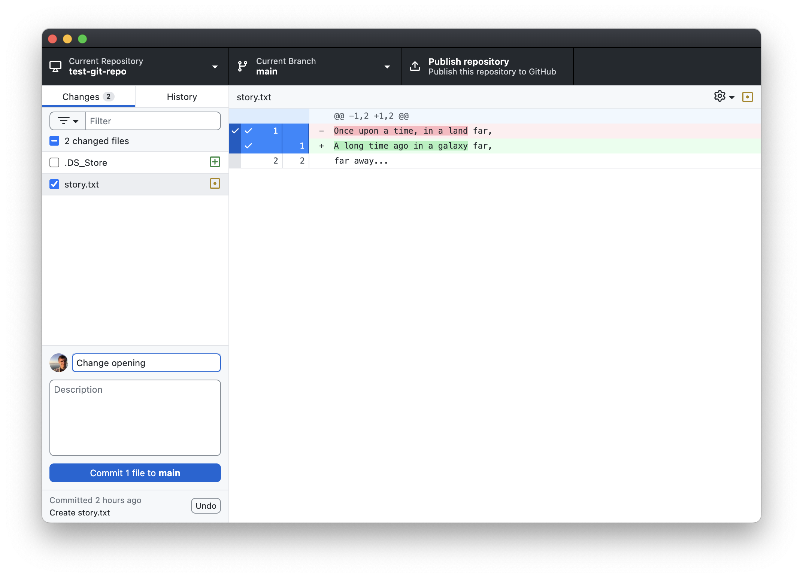

    You'll now see 2 commits in your history.

#### Adding files to `.gitignore`

It frequently happens that you can have files in your repository that you don't want Git to track. This can be things like temporary build files, or system files like the `.DS_Store` on Macs. If you don't explicitly commit a new file (by clicking the check mark next to it and hitting the commit button), then files won't be tracked. However, trying to avoid clicking these files can be tedious and error prone. You'll also get warnings about changes every time you switch branches (below).

We can tell Git to ignore certain files. Here, we'll tell it to ignore the `.DS_Store` file created by MacOS.


::: {.callout-note}
## Windows users
Windows users will not have a `.DS_Store` file or any other hidden file created by the OS as on Mac. To follow along in this part, create an empty file in your repository called `.DS_Store` and save it:

a.  Switch back to Notepad.

b.  Create a new file by typing <kbd>Ctrl</kbd>+<kbd>N</kbd>. This will open a new Untitled file that is empty.

c.  Click File -> Save.

d.  In the "Save as type" field click the drop-down menu and select "All files".

e.  In the File name field type `.DS_Store.`. **Note the trailing period!** That is, enter `.DS_Store.` not `.DS_Store` -- if you don't include the period at the end of the file name, Windows will automatically add `.txt` to the end.

f.  Click "Save"

:::

To tell Git to ignore a file:

1.  Right-click the file you'd like it to ignore, in this case `.DS_Store`. On the drop-down menu, select "Ignore file (Add to .gitignore)":

    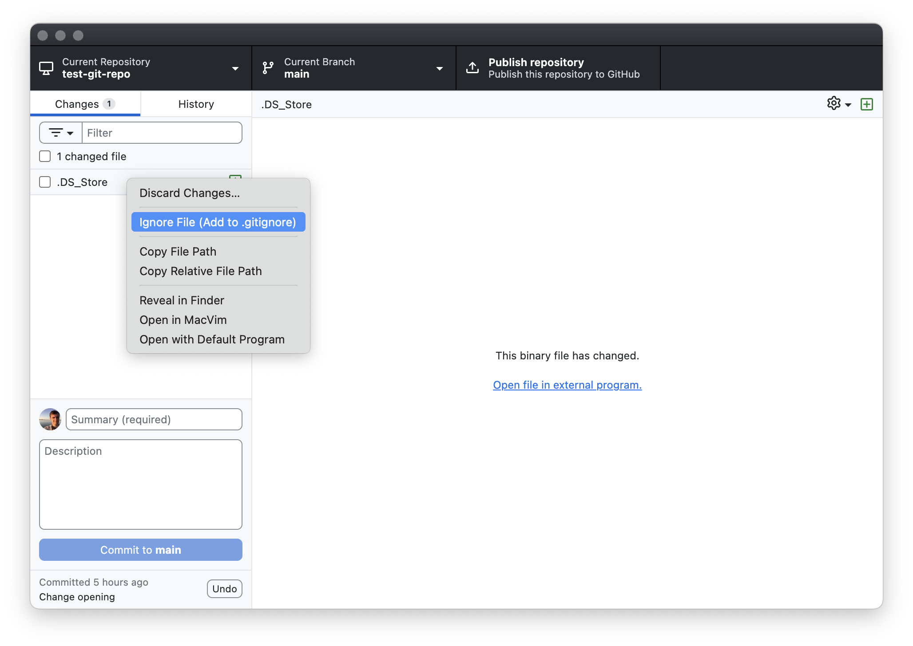

1. Adding the file will make the selected file disappear in the Changes menu. In it's place, you'll see a `.gitignore` file has been created. The `.gitignore` file is a simple text file that lists the names of any files in the repository that you want Git to ignore. Notice that GitHub Desktop has both created the file, and added `.DS_Store` to it:

    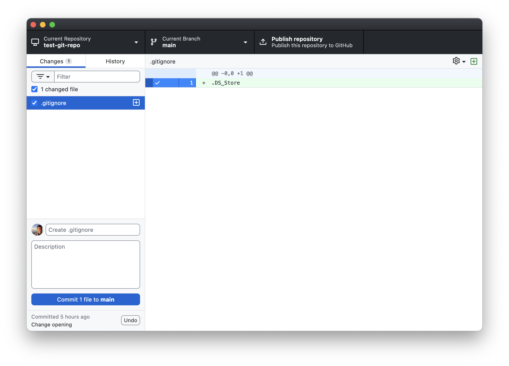

1.  As with any other file, we need to commit the changes to `.gitignore` for Git to keep track of it. Commit the change by clicking the "Commit 1 file to main" (note that the commit message automatically created by GitHub Desktop is "Create .gitignore").

1. From now on, any file named `.DS_Store` in this repository (meaning, in this folder and all sub-folders) file will not appear in your Changes menu, nor will you be able to commit changes to it to the repository.

### III. Branches

You want to start working on titles for your stories, but you want to do it independently of your work on the story itself. To do that, let's create a *branch* to specifically work on titles.

1.  In GitHub Desktop, click on the "Current Branch" tab. This will show a drop-down menu showing all of the branches on your repository:

    

    Currently, we only have one branch, which is called `main`. This is the Default branch, meaning it's the branch you are placed in whenever you first create or *clone* a repository (more on cloning later). Think of it as the master copy of your repository. If this were a code repository, the `main` would be the branch that you (try to) keep a clean, working version of your code.

1.  Let's create a new branch on which we will develop our title. Click the "New Branch" button in the upper right. You will be prompted to create a name. Call it `title-dev`, then click "Create Branch":

    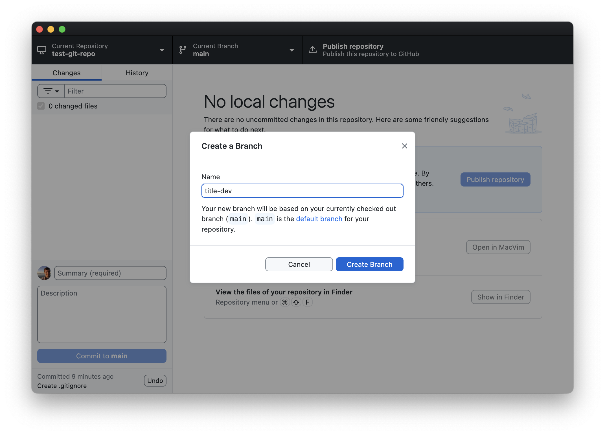

    You are now on a new branch called `title-dev`. You can see that by looking at the Current Branch at the top: it says title-dev:

    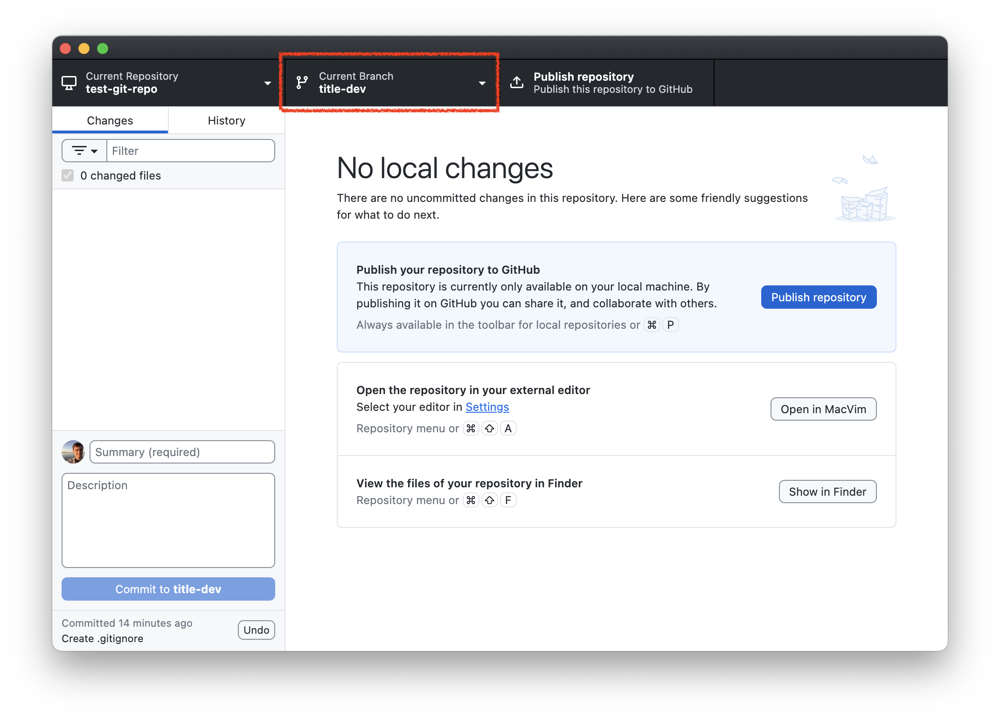

1.  You can switch between branches by clicking the "Current Branch" drop-down menu, then selecting the branch you want:

    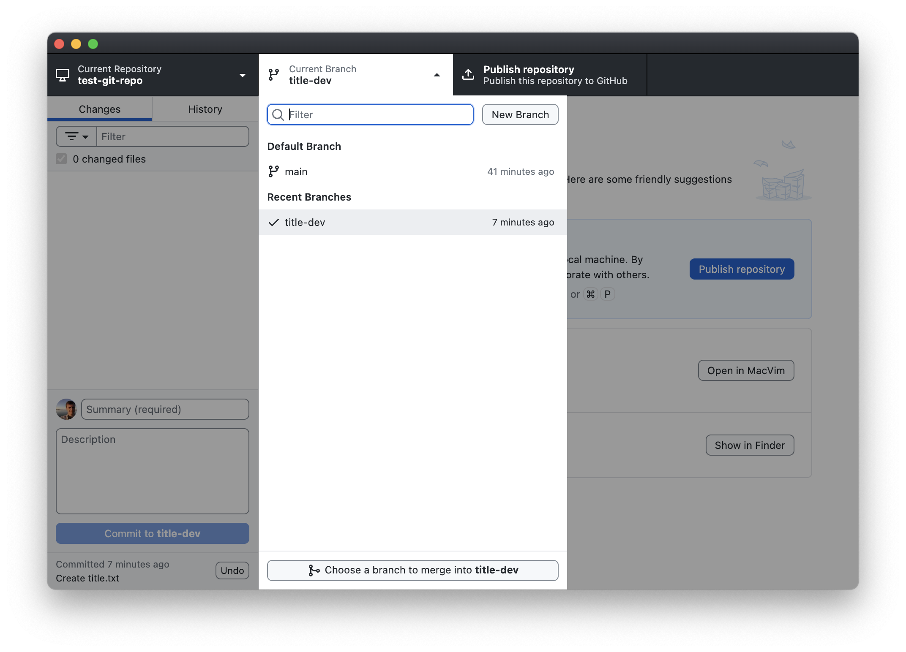

    Going back and forth between `main` and `title-dev`, you'll see that at the moment, the `title-dev` branch is identical to the `main` branch. You can verify that by viewing the contents of the repository in Explorer (Windows) / Finder (Mac). Click the "Show in Explorer" (Windows) / "Show in Finder" (Mac) button. You'll see that `story.txt` is still there no matter if you're on `title-dev` or `main`.

    Likewise, the commit history for `title-dev` is also the same as `main`: switch to the `title-dev` branch then click on the History tab. You'll see the same 4 commits as you have on `main`.

1.  Let's do some development on `title-dev`. Switch to the `title-dev` branch. Now let's create a file called `title.txt` to store our title idea:

    * **Windows users:**
        a. Switch back to Notepad.
        a. Type <kbd>Ctrl</kbd>+<kbd>N</kbd> to create a new untitled file.
        a. Click File -> Save
        a. In the "File name" field enter `title.txt` then click "Save".

    * **Mac users:**
        a. Switch back to TextEdit.
        a. Type <kbd>&#8984;</kbd>+<kbd>N</kbd> to create a new untitled file.
        a. Select Format -> "Make Plain Text". (We need to do this to get the desired file extension.)
        a. Click File -> Save...
        a. In the "Save As" field type `title.txt`.
        a. Click "Save".


1.  Add a title to `title.txt`. Use your text editor to add:
    
    ```
    STAR FIGHT!
    ```

    Save the change by typing <kbd>Ctrl</kbd>+<kbd>S</kbd> (Windows) / <kbd>&#8984;</kbd>+<kbd>S</kbd> (Mac). 
    
1.  Go back to GitHub Desktop. You should see `title.txt` in the Changes sidebar, with the new lines shown in the diff:

    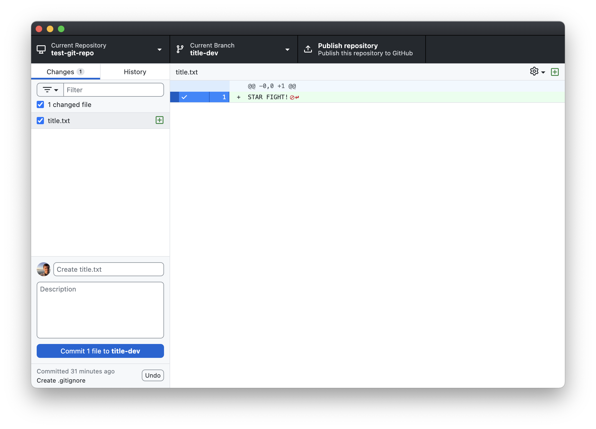

1.  Commit the new changes by clicking "Commit 1 file to title-dev". Note the default commit message is "Create title.txt".


1. Satisfied with your title for now, go back to your main branch by clicking on the "Current branch" drop down and selecting `main`:

    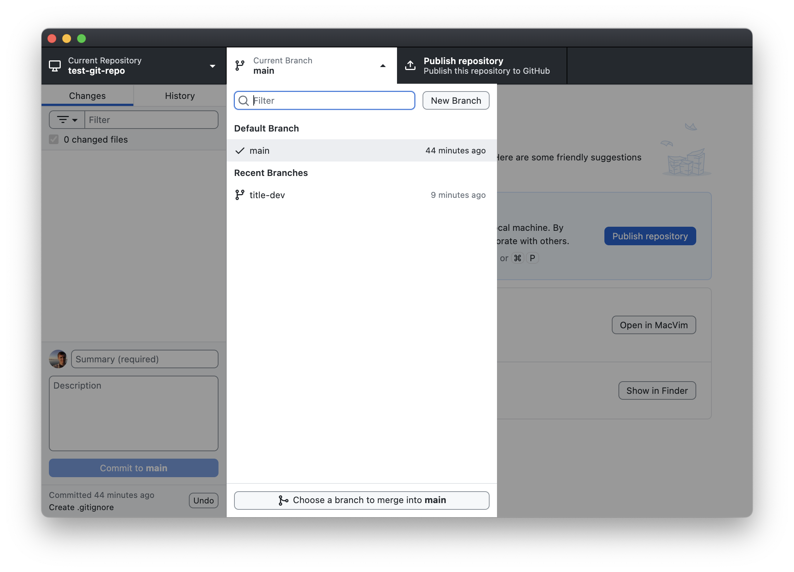

1.  Let's see what happened to your files when you switched back to `main`. If you still have the Explorer/Finder window open, look at it. If not, click the "Show in Explorer" (Windows) / "Show in Finder" (Mac) button to view the contents of the repository.

    The `title.txt` file is gone!

    Likewise, if you click on the "History" tab in GitHub Desktop, you'll see that your last commit is no longer in your history; you just have the first four commits.

    This is because your last commit (and the file it created, `title.txt`) only exists on the `title-dev` branch. To verify that it's still there, click the "Current Branch" drop-down menu and switch to the `title-dev` branch. You'll see the "Create title.txt" commit reappear in your History. You'll also see the `title.txt` file reappear in your directory in Explorer/Finder. Toggling back and forth between the branches will make it disappear and reappear.

    What's going on? In graph form, your repository currently looks like this:

    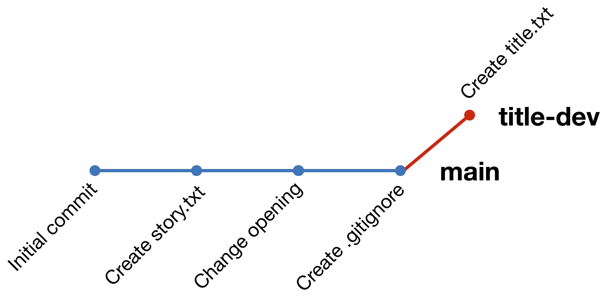{height=300}

    Here, each dot represents a commit, and the different lines represent a different branch. Following a line illustrates the history as seen by that branch. Since the commits on `title-dev` live on their own branch, changes you make on `main` won't affect `title-dev` and vice versa (at least not until we merge the branches; more on that below).

1. Let's make some more changes to `story.txt`, but let's do it on the `main` branch. Switch to `main` using the "Current Branch" drop-down menu. Now use your text editor to add the following lines to `story.txt`:

    ```

    It is period of civil war.
    Rebel spaceships, striking
    from a hidden base, have won
    their first victory against
    the evil Galactic Empire.
    ```

    Save the changes by typing <kbd>Ctrl</kbd>+<kbd>S</kbd> (Windows) / <kbd>&#8984;</kbd>+<kbd>S</kbd> 

1. Stage the commit by clicking the check mark next to `story.txt` in GitHub Desktop and change the commit message to "Add first pargraph":

    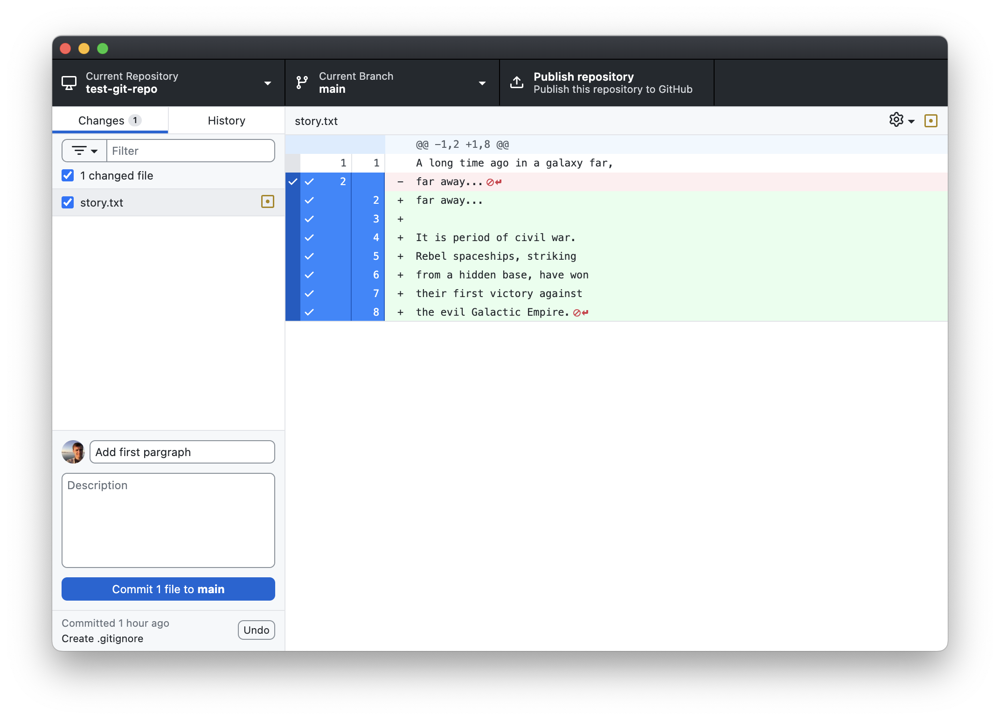

    Now commit the changes by clicking "Commit 1 file to main".

1.  Click on the History tab. Note that you now have 5 commits on master, none of which include the commits to `title-dev` branch.

1.  In a flash of brilliance, you get an idea for the title of your story. Quick! Switch to your `title-dev` branch by clicking the Current Branch -> title-dev.

    Now use your text editor to edit `title.txt` and change `STAR FIGHT!` to:
    
    ```
    Star Wars
    A NEW HOPE

    by
    George Lucas
    ```
    
    Nice work, George!

1.  Save your changes to `title.txt` and stage the changes in GitHub Desktop by clicking the check box next to `title.txt`. Commit the changes by clicking the "Commit 1 file to title-dev":
   
    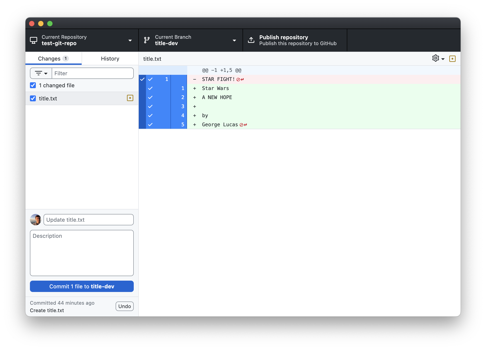
   
    Note that the commit message is "Update title.txt".

1.  Click on the History tab. Note that there are 6 commits here: the first four from `main` (before you branched off), and the last two on `title-dev`:

    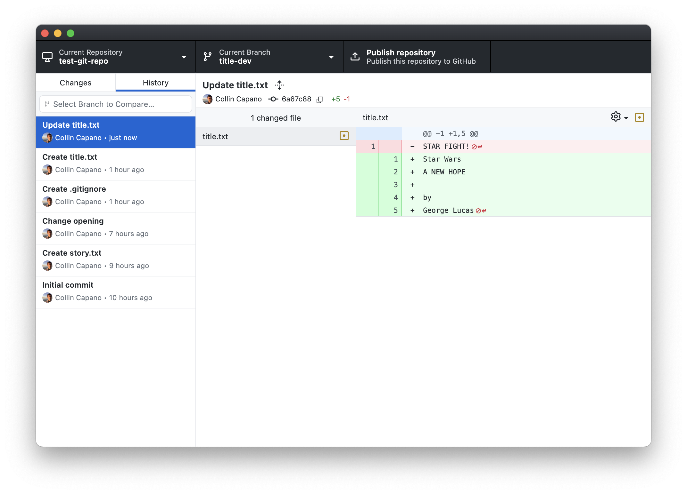

    In graph form, your repo looks like this:

    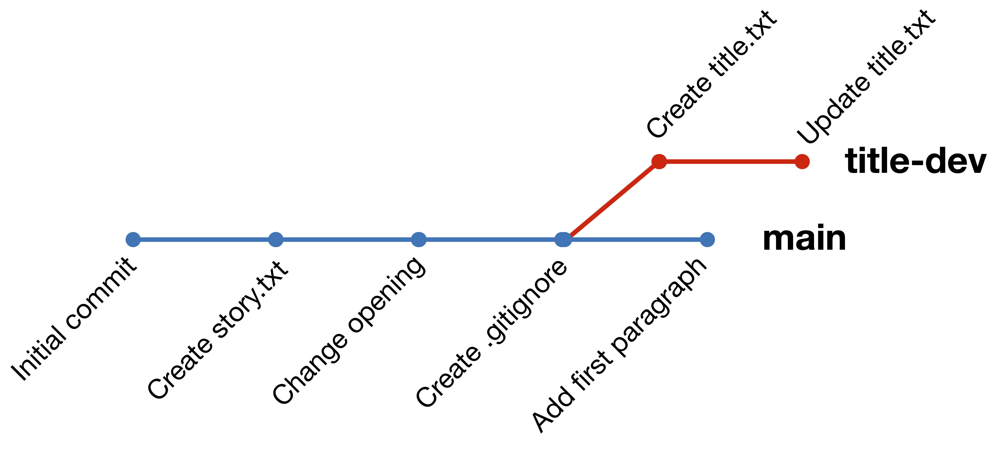{height=300}

#### Merging

1.  Satisfied that your title is perfect, you no longer feel the need to keep the title development on a separate branch. It's ready to be *merged* on to the `main` branch. To do that, first switch to the main branch by clicking Current Branch -> main.

1. Before merging `title-dev` on to `main`, we're going to create a second copy of `main` that we'll call `main-bkup`. We'll do that here so we can demonstrate squash and merge below. But when you first start using Git, it's good practice to create a backup of `main` before doing merges, as mistakes can happen that can be difficult to untangle. This way, you have the original state of `main` preserved in the backup branch that you can always go back to.

    To create the copy of `main`:

    a.  Click Current Branch. Make sure you're on `main` (the checkmark is next to `main`), then click "New Branch":

        

    b.  This will open the "Create a Branch" window. Type `main-bkup` in the Name field, then click "Create Branch". You will now be on the `main-bkup` branch.

    c.  Now go back to the `main` branch by clicking "Current Branch -> main".

1.  Now click the Current Branch drop-down menu again, and this time click the "Choose a branch to merge into *main*" button:

    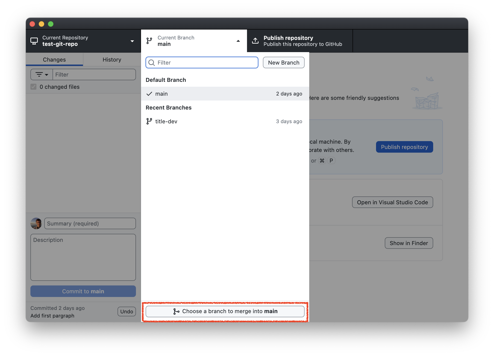

1.  Select the `title-dev` branch. The button at the bottom will turn to blue and say "Create a merge commit". Click that to merge the branch:

    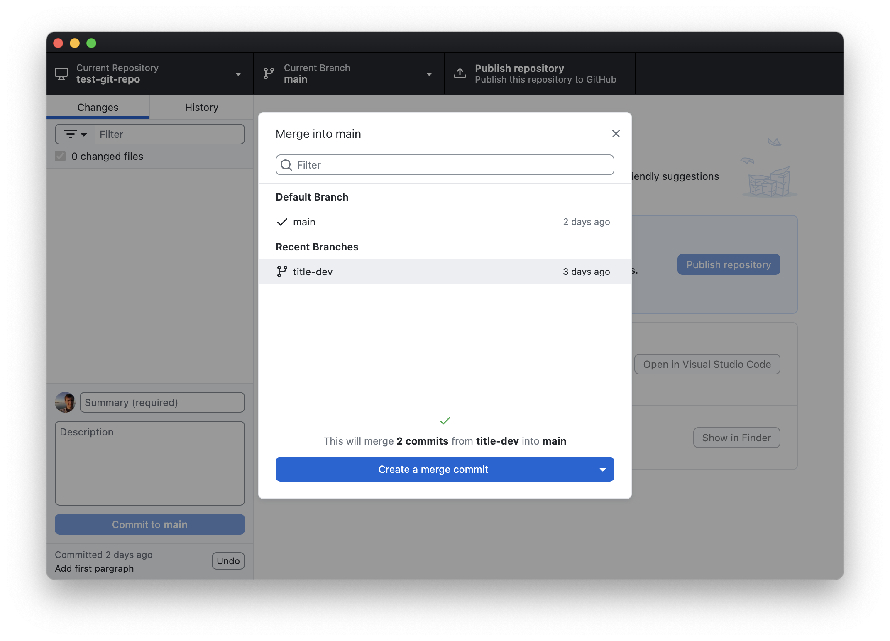

1.  Congratulations! You've made your first merge on to main. To see what happened, click on the History tab to see what the history on the main branch looks like now:

    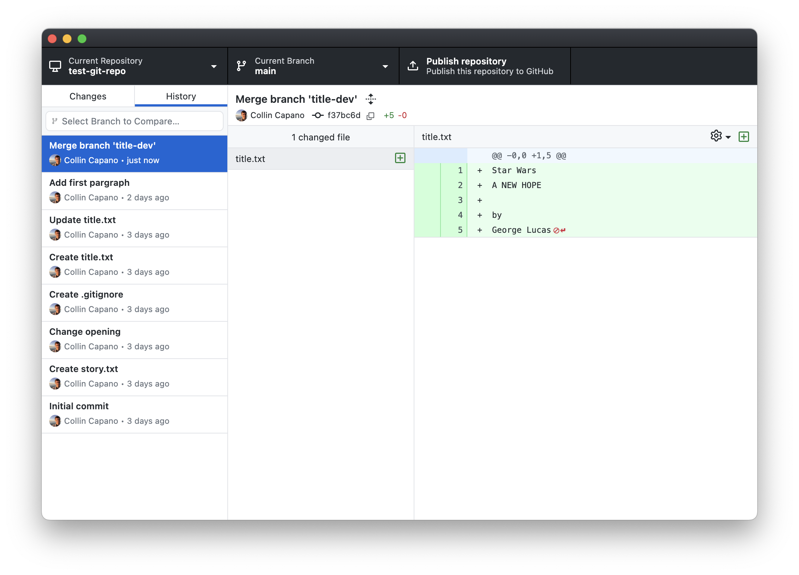

    The commits you made on `title-dev` are now in `main`, along with a final "Merge" commit at the end. This final "merge" commit is to indicate that some of the commits in the history came from another branch (and what the name of the branch was). 

    If you look at Explorer/Finder, you'll see that `title.txt` is now in your directory when you're on `main`. If you switch between `main` and `title-dev`, `title.txt` remains in both. Note that the history on `title-dev` is unaffected by the merge: merging only changes the branch you merged *into*, not the branch you merged *from*.

    In graphical form, you `main` branch now looks like this:

    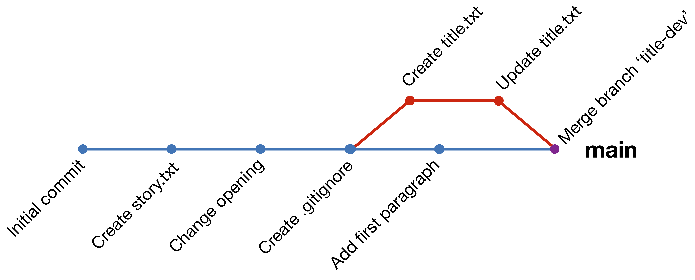{height=300}


#### Squash and merge: the cleaner history

When we were preparing to merge `title-dev`, you may have noticed there was a drop-down button next to the "Create a merge commit" button:

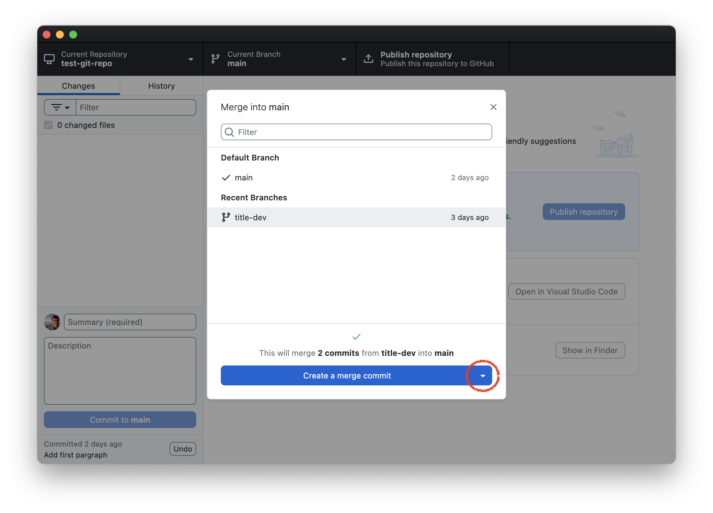


If you had clicked that, you are presented with three options -- merge, squash and merge, and rebase:

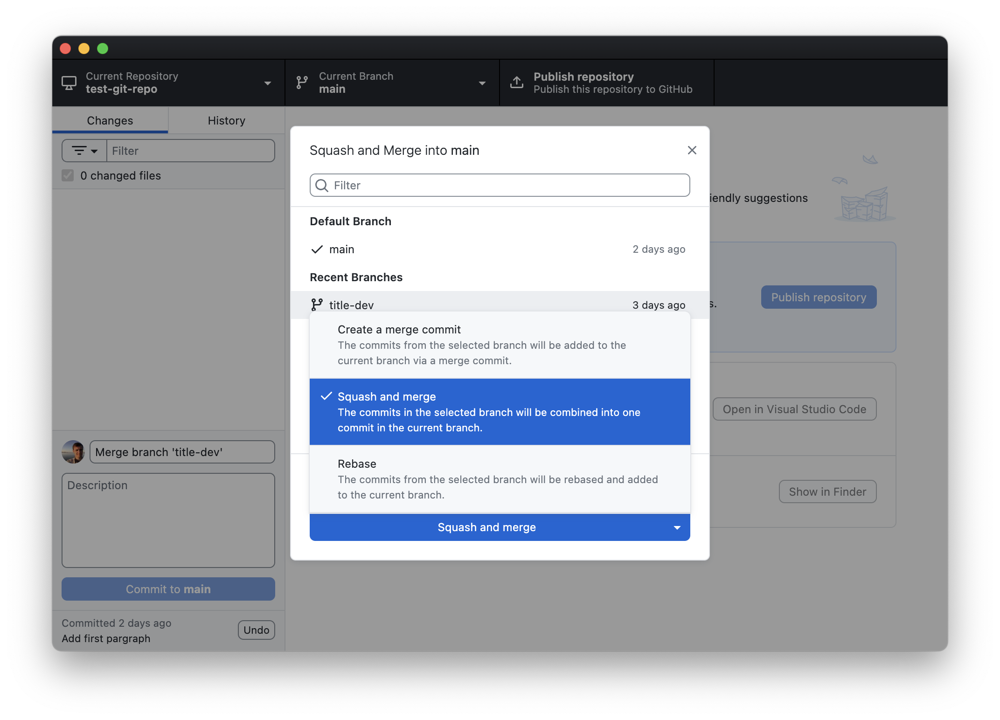

Let's see would have happened if we selected **squash and merge** instead by doing a squash and merge on to `main-bkup`.

1.  Switch to the `main-bkup` branch by clicking "Current branch -> main-bkup".

1.  Click "Current branch" again, and select "Choose a branch to merge into main-bkup". Select "title-dev", then click the drop down arrow next to the "Create a merge commit button":

1.  Select "Squash and merge". This will change the blue button to read "Squash and merge". Click that to do the squash and merge.

1.  Click the History tab to see what the history on `main-bkup` looks like:

    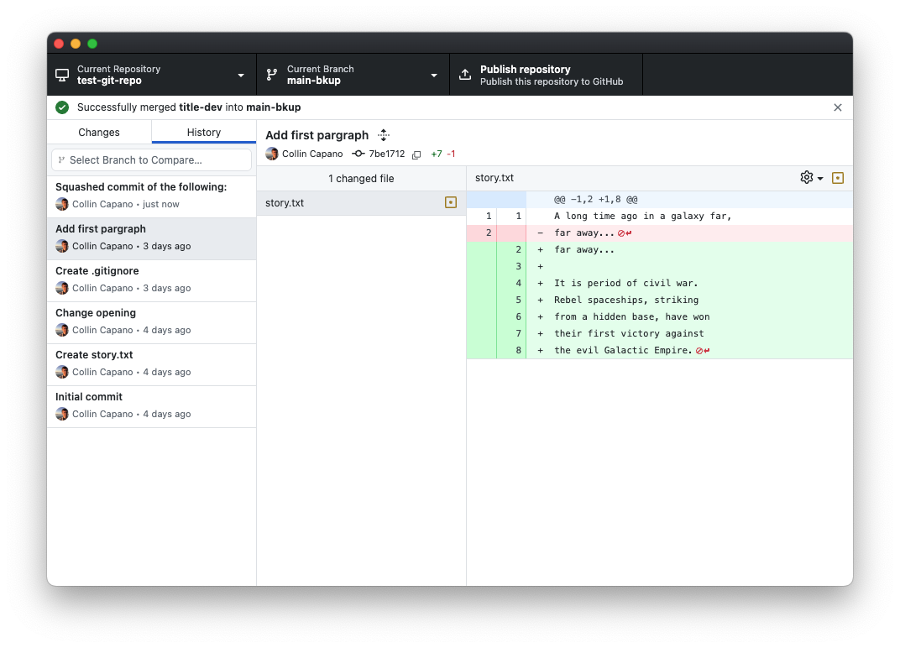

    The two commits that were done on `title-dev`, as well as the final merge commit, have all been "squashed" into a single large commit, which is placed at the end of the history on `main-bkup`. In graphical form, the history on `main-bkup` now looks like this:

    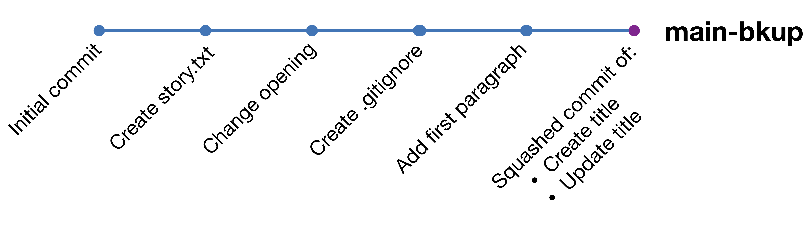{width=800}

    The contents of `main-bkup` are exactly the same as `main`, just the history is different. (You can verify this by switching between `main` and `main-bkup`.)

##### When do you use squash and merge vs merge?

It's up to you, as each has its pros and cons:

**Merge**

*   Pros:
    *   Preserves entire development history.
    *   If multiple authors contributed to a development branch, their contributions are attributed in the history. This makes it easier to tell who did what using `git blame`.
    
*   Cons:
    * Makes for a complicated history.
    * Development branches can consist of many small commits. You probably don't want every little "fix typo" commit in your history on `main`.

**Squash and merge**
    
*   Pros:
    * Makes for a much cleaner history: all new developments are contained in a single commit.
    * GitHub Desktop will formulate the merge commit message to include all the commit messages from the development branch for reference.
    
*   Cons:
    * It will look as though one person wrote all the changes in the commit since all the commits on the development branch are condensed into a single commit. If multiple people contributed to the branch, their attribution is lost, making it difficult to know who did what using `git blame`. Their attribution can be worked out from looking at the commit message and referring to the development branch (if it's not deleted), but this can be tedious.

Personally, I use Squash and Merge most of the time to keep the history on `main` clean and straight forward (this is particularly nice on GitHub when using pull requests, as it will refer to the PR in the commit message; we will see this in exercise 3). But when working with someone else on a branch I will sometimes use Merge instead.


::: {.callout-note}
## What about rebasing?
There is another way to merge branches called *rebasing*. Rebasing changes the history of the development branch to make it look like all the commits came after the last commit on main. This is mostly useful for keeping a development branch up to date with `main`. For more on rebasing, see this article by the Atlassian corporation: [Merging vs. rebasing](https://www.atlassian.com/git/tutorials/merging-vs-rebasing).
:::

#### Deleting branches

Now that you've merged your `title-dev` branch, you can delete it to save space. To do that, click Current Branch, then **right click** `title-dev`. This will yield a drop-down menu. Select "Delete branch":

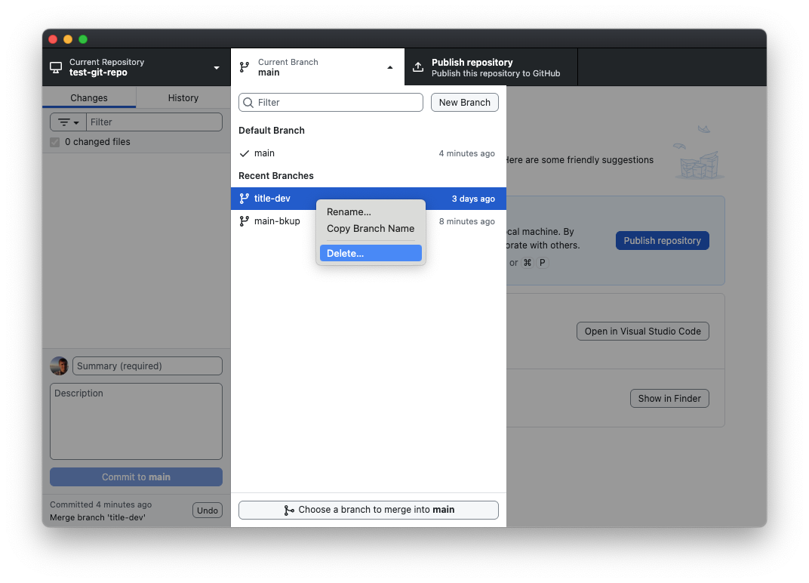


You will be prompted with a warning. Click the "Delete" button. The `title-dev` branch will be gone! You can also delete `main-bkup` now if you like.


### Challenge Questions: Editing the same file on different branches

In the above example we only made changes to different files on our two branches: on `main` we only edited `story.txt`, while on `title-dev` we only edited `title.txt`. However, there is nothing stopping us from editing the *same* file concurrently on two different branches. The following questions will illustrate how that works.

:::: {.callout-caution appearance="simple" icon="false"}
#### Question 1: Setup

Create a file called `list.txt` that initially contains the following three lines:

```txt
alpha
bravo
charlie
```

Now use the what you learned above to do the following:

1. Add and commit `list.txt` to `main`.

2. Create a branch called `dev1`.

3. On `dev1` change the first line of `list.txt` to `delta` (i.e., replace `alpha`) then commit the change. Make the commit summary mesage be "add delta to list" when you do.

4. Go back to `main` and change the third line to `foxtrot` (i.e., replace `charlie`), then commit it.


::: {.callout-caution collapse="true" appearance="simple" icon="false"}
##### Solution

1.  Once you create `list.txt` (use your text editor to do this), you should see it appear in the Changes tab in GitHub Desktop. Make sure you're on `main` (the Current Branch should say `main`; if not, click Current Branch -> main). Then:

    a.  Click the check mark next to `list.txt`.
    b.  Optionally add a summary, or just use the default "Create list.txt".
    c.  Click the "Commit 1 file to main".
    
2.  Do the following:

    a.  Click Current Branch -> New Branch.
    b.  Type `dev1` in the Name field.
    c.  Click Create Branch.

3.  Use your text editor to open `list.txt` and change the first line to `delta`. As soon as you save the file, you should the new line appear in the Changes tab on GitHub Desktop. Click the check mark next to `list.txt`, then type "add delta to list" in the summary field (this will replace the default "Update list.txt"), then click "Commit 1 file to dev1".

4. Do the following:

    a.  If list.txt is open in your text editor, close it. Then click "Current branch" -> main to switch back to main.
    b.  Open list.txt with your text editor and change third line to `foxtrot`, then save and exit.
    c. list.txt should appear in the Changes tab. Click the check mark next to it.
    d. Add "add foxtrot to list", then click "Commit 1 file to main".

:::

When you are done, `list.txt` should look like the following on `main`:

```txt
alpha
bravo
foxtrot
```

while on `dev1` it should look like:

```txt
delta
bravo
charlie
```

::::


:::: {.callout-caution appearance="simple" icon="false"}
#### Question 2: Editing different lines

Now suppose you merge `dev1` into `main`. What happens to `list.txt`?

**A.** `main` takes precedence since it's the branch being merged into; `list.txt` will look like:

```txt
alpha
bravo
foxtrot
```

**B.** `dev1` takes precedence since it's the branch being merged; `list.txt` will look like:

```txt
delta
bravo
charlie
```

**C.** The changes from both are adopted; `list.txt` will look like:

```txt
delta
bravo
foxtrot
```

**D.** An error is raised because the same file was modified.

*If you're not sure, try it yourself and see what happens!*


::: {.callout-caution collapse="true" appearance="simple" icon="false"}
##### Solution

The answer is **C**. Since different lines have been modified, `git` is able to merge the changes together without issue. To do it yourself:

a.  Click Current Branch -> main to switch to main.
b.  Click Current Branch -> "Choose a branch to merge into main"
c.  Select dev1 then click "Create a merge commit".

:::
::::

:::: {.callout-caution appearance="simple" icon="false"}
#### Question 3: Editing the same lines

After merging `dev1` on to `main`, suppose you create another branch called `dev2`. On `dev2` you change the second line of `list.txt` to be `echo` while on `main` you change the second line to `easy`; i.e. on `main` `list.txt` looks like:

```txt
delta
easy
foxtrot
```

On `dev2` `list.txt` looks like:

```txt
delta
echo
foxtrot
```

**What happens if you merge `dev2` into `main` in this case?**

**A.** `main` takes precedence since it's the branch being merged into; `list.txt` will look like:
    
```txt
delta
easy
foxtrot
```

**B.** `dev2` takes precedence since it's the branch being merged; `list.txt` will look like:

```txt
delta
echo
foxtrot
```

**C.** The changes from both branches are adopted; `list.txt` will look like:

```txt
delta
easy
echo
foxtrot
```

**D.** An error is raised because the same line is modified.


::: {.callout-caution collapse="true" appearance="simple" icon="false"}
##### Solution

The answer is **D**, an error is raised. Since the same line has been modified in the same file, `git` cannot tell how to reconcile the differences. This is known as a *merge conflict*. In this case, `git` will leave it up to the user to reconcile the differences. How to do that is discussed in the next section. 

:::
::::

### IV. Resolving merge conflicts

As illustrated in the Challenge Questions, if the same lines in the same file are modified on two different branches, `git` will not know how to merge the changes. This is called a **merge conflict**. In this case, `git` will ask you to reconcile the differences. To illustrate, let's try merging `dev2` into `main` after making the changes to `list.txt` discussed in Question 3 above:

1. If you have not done so, try to merge `dev2` into `main` after making the changes to the second line of `list.txt` discussed in Question 3:

    a.  Switch to `main`: Click Current Branch -> main.
    b.  Click Current Branch -> Choose a branch to merge into "main".
    c.  Select dev2, then  click "Create a merge commit" (note that a message pops up above the button that says there be 1 conflicted file).

1.  When you try to do the merge, you will get the Resolve conflicts box:

    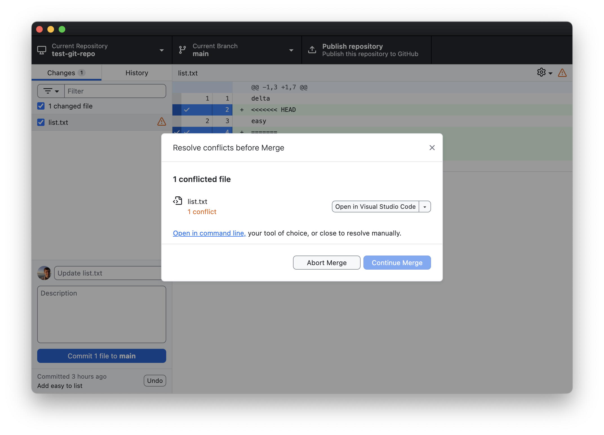

    This tells you what files are conflicted (in this case `list.txt`).

    To fix this, we need to manually resolve the conflict. There are several options to deal with this. If you have VS Code or some other code editor installed, you will see an option to open the file in that program. Here, though, we'll use our simple text editor to resolve the issue.

1.  Open list.txt with your text editor. You should see the following:

    ```txt
    delta
    <<<<<<< HEAD
    easy
    =======
    echo
    >>>>>>> dev2
    foxtrot
    ```

    `git` has added the conflicting lines from both branches to the file, along with information about the two branches. The line as it appears on `main` is prefaced with `<<<<<<< HEAD`. This indicates that the following line(s) is (are) how it appears on the branch being merged into. The line(s) is (are) followed by a `=======`.

    After the `=======` the line(s) as it/they appear(s) on the branch being merged are shown. These are followed by `>>>>>>> BRANCH_NAME` (here, `BRANCH_NAME` is `dev2`).

1.  We are free to edit the file anyway we like to resolve the conflict. You should remove the `<<<<`, `====`, and `>>>>` lines that `git` has added, along with the edit you want to make to resolve the conflict.

    In this case, let's keep the edit as it appears on `dev2`, and remove the edit on `main`. Delete the appropriate lines so that the file looks like:

    ```txt
    delta
    echo
    foxtrot
    ```

    Then save and exit the file.

1.  As soon as you save the changes to `list.txt`, the merge conflict window in GitHub Desktop will change to show that all conflicts have been resolved:

    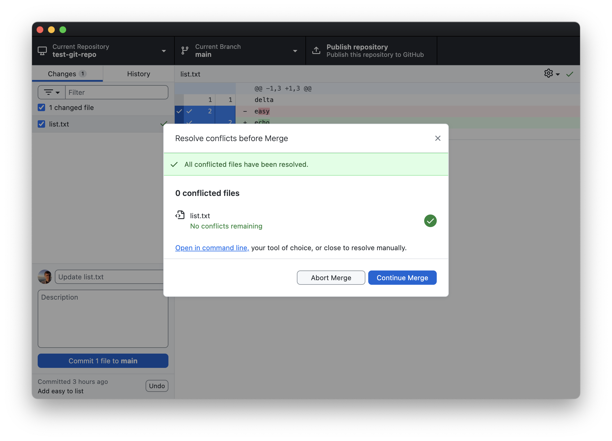

    Click "Continue Merge".

1. The merge conflict is resolved! If you click on the History tab you will see the history with all the commits in it, as if you had a merged without any issue.

Merge conflicts happen, but can be fixed fairly easy. If there were multiple areas in a file that caused a conflict, the conflicting areas would all be surrounded by the same `<<<<<<< `/`=======`/`>>>>>>>` lines that we saw above. You'll want to search through the file for those to make sure you got all the conflicts. If multiple files had conflicts, `git` will make you resolve all of them before allowing the merge to complete.

### Summary

That's the basics of how to use `git`. In the following parts we'll see how to use this with GitHub and how to collaborate with partners using `git` and GitHub.
