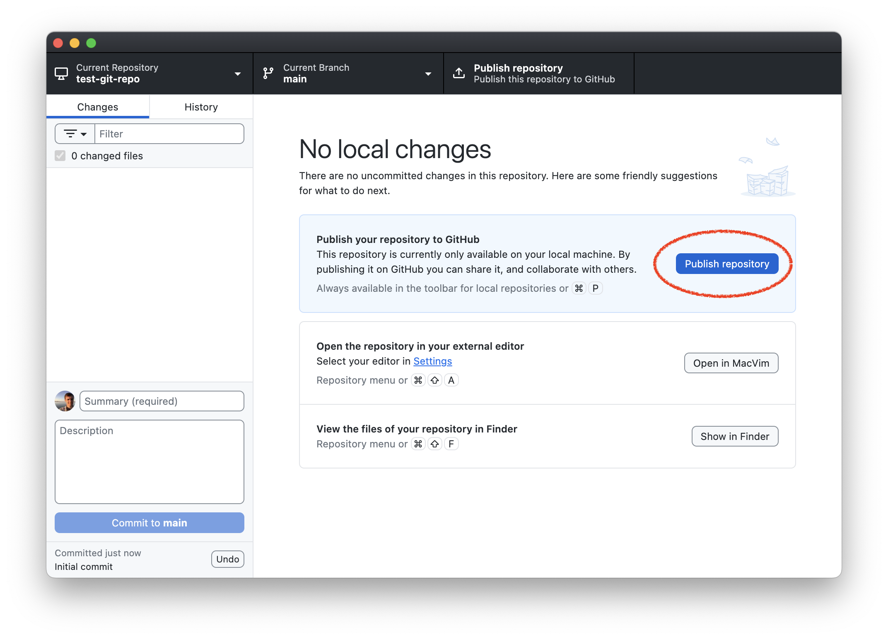
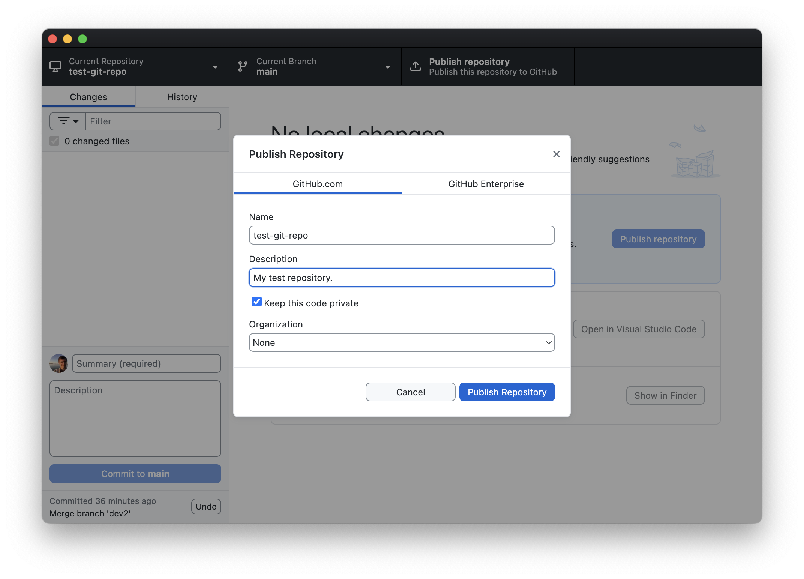
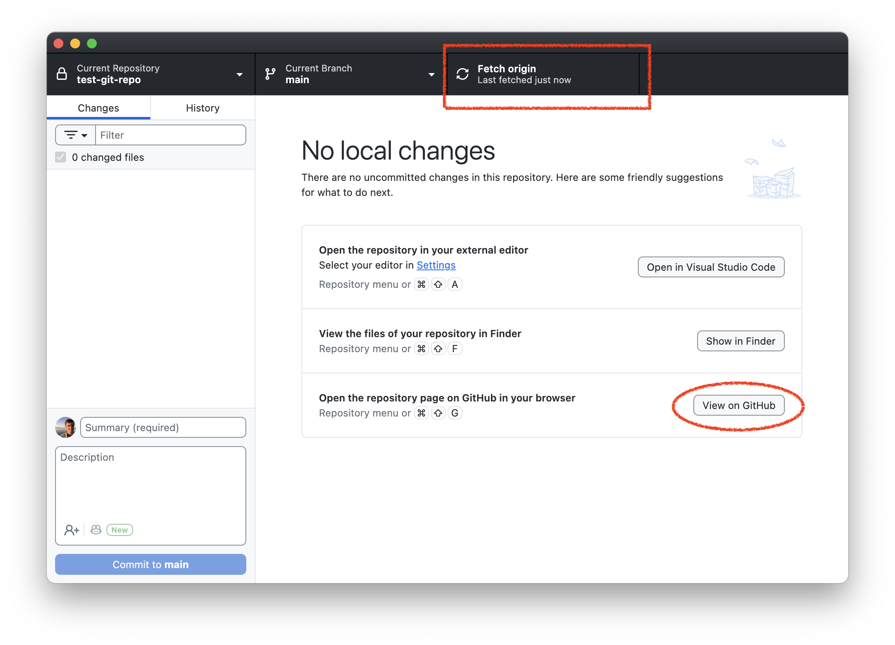
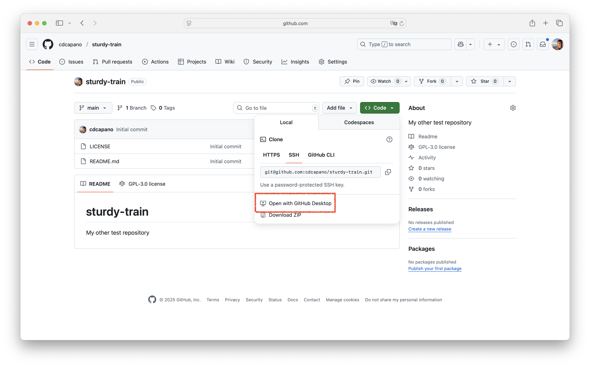
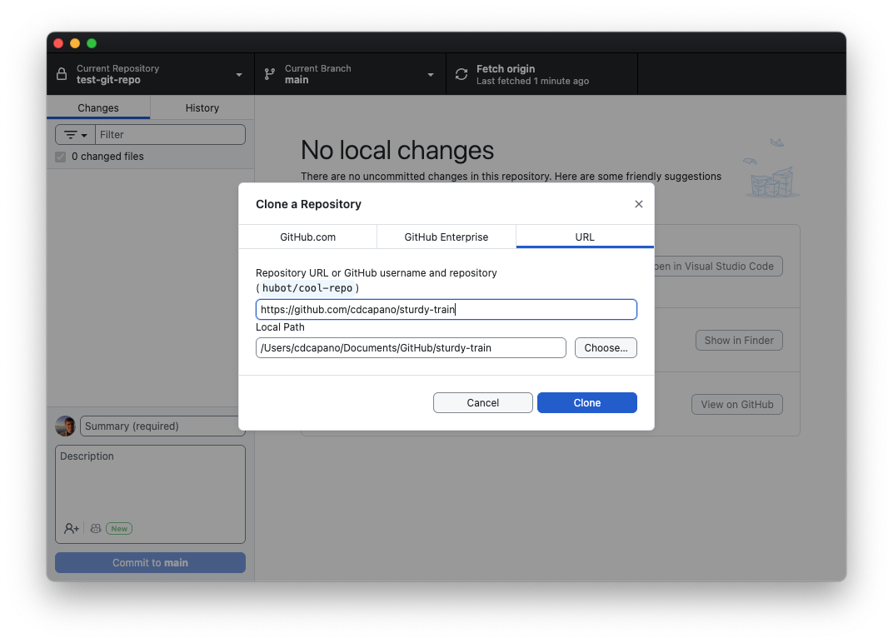
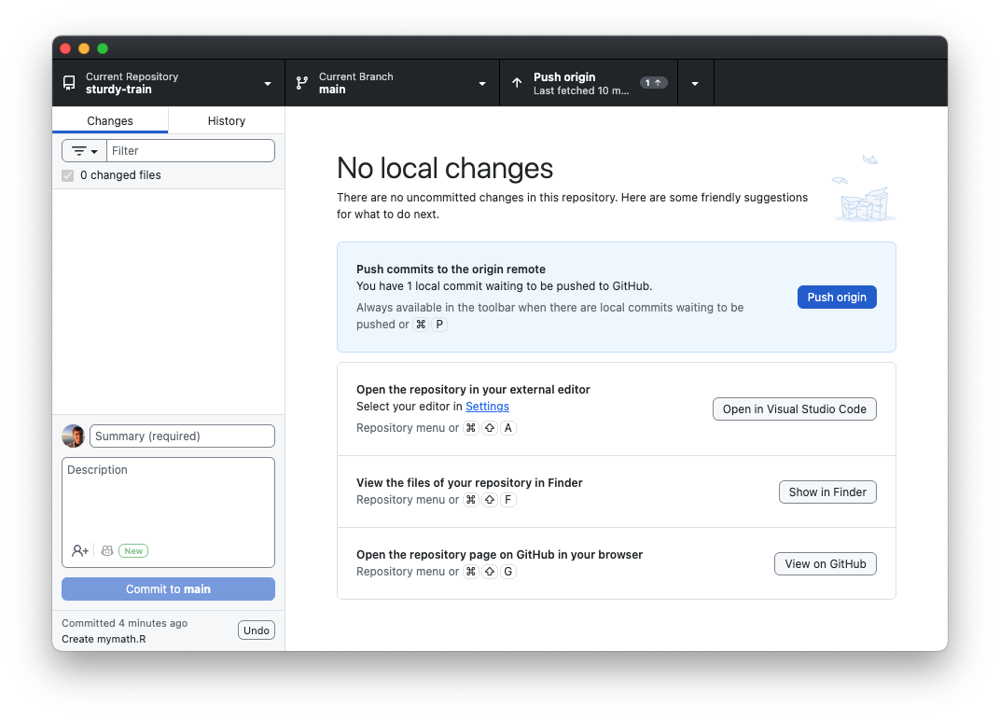
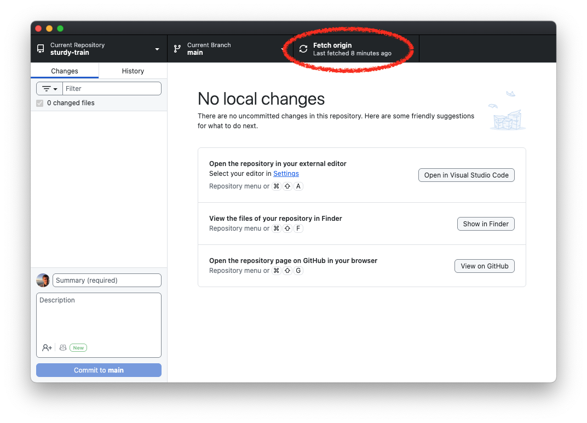
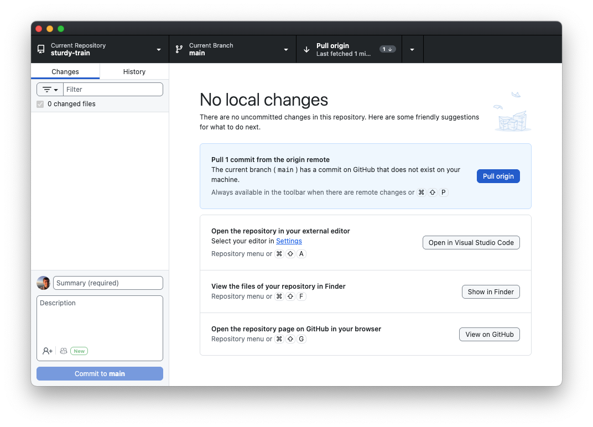
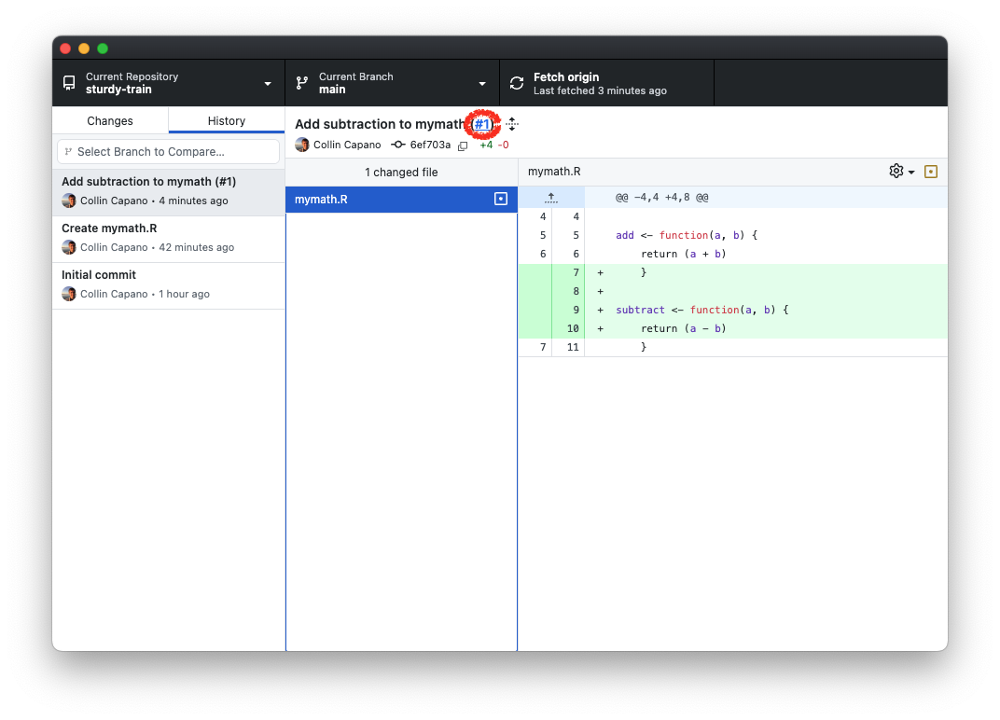

Exercise 1 illustrated how to create a new git repository on your local computer. In this exercise we'll learn how to use GitHub to manage a repository.

## I. Add a repository on GitHub

There are two ways to add a repository to GitHub: (1) publish a repository to GitHub you initially created on your computers; (2) create a new repository on GitHub using their online interface, then *clone* it to your local computer. Below we illustrate both methods.

### 1. Publish a local repository

1.  If it's not already open, open the `test-git-repo` you created in [Exercise 1](exercise1.qmd) with GitHub Desktop.

1.  Click the "Publish repository" button:

    

1.  This will open a new window. On the GitHub.com tab enter a brief description for the repo (e.g., "My test repository"), select "Keep this code private", and set Organization to None (it should be by default):

    

    Now click "Publish repository".

1.  When you return to the GitHub desktop home screen you will notice a few differences:

    

    In the top right you'll see it now says "Fetch origin". We will see what this means below. You will also see a button that sees "View on GitHub". Click that.


1.  When you click on "View on GitHub", your web browser will open. You'll be at the website for your GitHub repository, which will live in your GitHub account.

    Congratulations! You've published a repository to GitHub. We'll see what we can do with GitHub below.

### 2. Create a repository on GitHub

More often then not, you will copy already existing repositories on GitHub to your local computer. This is called **cloning**. To illustrate that, let's create a new repository directly on GitHub, then clone that to our local computer.


1.  Go to https://github.com and sign in if you are not already. Then go to https://github.com/new to create a new repository.

1.  In the Owner section, click the drop down "Choose an owner" and select yourself.

1.  You'll need to put a name in the "Repository name" field. GitHub will offer a suggestion (where it says "Need inspiration? How about ..."). Use the suggested name. That should ensure that the repostiory name is unique, which will make doing Exercise 3 easier.

1.  Under "Description" put "My other test repository."

1.  Make sure "Public" is selected. We'll make this repository public so that you can collaborate with a partner on it in [Exercise 3](exercise3.qmd).

1.  Check the box for "Add a README file". This will cause your repo to be initialized with a README.md file in it. It isn't strictly necessary, but is good to have, as it's what GitHub will show by default when people go to your repository.

1.  Under "Choose a license" select "GNU General Public License v3.0". This will cause your repository to be initialized with a LICENSE file that has the GNU Public License v3.0 in it (an open source license). Choosing a license isn't strictly necessary, but it's good practice.

1.  Now click the "Create repository" green button. This will create your repository. You will have the repository webpage open.


## II. Cloning a repository from GitHub.com

We want to add things to your repository. You can do that through the web interface, but it's easier to do it on your local computer, especially for code development so that you can test things. To do that we'll need a local copy of your repository. This is what `git clone` does: it downloads a local copy of your remote repository (which lives on GitHub) that can *track* the remote repository.

To clone the repository, click the Green `<> Code` button in the upper right. Then click "Open with GitHub Desktop":



This will open the "Clone a Repository" window in GitHub Desktop:



Don't change any values. Just click "Clone".

You will now have a new directory in your GitHub folder on your computer that has the same name as the repo on github.com. Click the "Show in Explorer/Finder" button to see the contents of the repo. You should see the `README.md` file and the `LICENSE` file listed.

This is your local copy of your repository. It's setup to track your repo on GitHub, which is called the **origin** repository.

::: {.callout-note}
For the rest of this exercise we will work with the repository you created on GitHub and cloned to your local computer.
:::

## III. Pushing to your remote repository

1.  Let's add a file to your repository. Use your text editor to create a file called `mymath.R` (refer to [Exercise 1](exercise1.qmd) if you forgot how to do that) and put the following in it:

    ```R
    !#/usr/bin/env R

    # Some math functions

    add <- function(a, b) {
        return (a + b)
        }
    ```

This is a simple R program that contains a function to add two numbers.

1.  Add and commit your file to your repo using GitHub Desktop. (Review [Exercise 1](exercise1.qmd) if your forgot how.)

1.  Now look at your copy of the repository on GitHub in your web browser. (You may want to open your web browser side-by-side with GitHub Desktop to make the rest of the exercise easier.) Is `mymath.R` there? No. Try refreshing the page. Is it there? Still no. This is because you have only committed the file to your *local* copy of the repository. The origin repository on GitHub doesn't know about these changes.

1.  You may have noticed that after you committed `mymath.R`, a button appeared in GitHub desktop telling you to *push* the changes to the origin repository on GitHub:

    

    *Pushing* changes is how you update your remote repository on GitHub.

    Click the "Push origin" button to send the changes to GitHub.

1.  Go back to your web browser and refresh your repository page. You should now see the `mymath.R` file there. You can click on it to view it if you like. You can also see your commit history on GitHub (click the icon that looks like a clock just below the green `<> Code` button on the front page of your repository). Notice that the history on GitHub is the same as your history on your local computer. Your repos are in sync!

## IV. Fetching changes on GitHub & creating pull requests

Let's create a branch to do some development work. We could do this on our local computer, but let's do it on GitHub instead.

1.  Click the drop down button that says "main" in the upper left corner of the website. Then click "View all branches". This will bring you to another page that shows you all your branches. Currently we only have one, `main`. Create a new branch by clicking the green `New branch` button in the upper right. In the "New branch name" field type `dev1` then click `Create new branch`. This will create the new branch.

1.  Now let's make some changes on the `dev1` branch on our local computer. To do that, we'll need to update our local repo to pickup the new branch. Go to GitHub Desktop and click "Fetch origin" in the upper right:

    

1.  Now click "Current Branch". You'll see under "Other branches" `origin/dev1`. Click on it to switch to that branch. You now have a `dev1` branch on your local repository that is set to *track* the remote one on GitHub. This means that when we push from this branch it will by default push changes to the `dev1` branch on GitHub, not the `main` branch.

1.  Let's modify `mymath.R` on `dev1`. On your local computer, use your text editor to open `mymath.R` and add the following to it:

    ```R

    subtract <- function(a, b) {
        return (a - b)
        }
    ```
    
    Save the changes.

1.  Commit the changes to `mymath.R` to the dev1 branch on your local repo using GitHub Desktop.

1.  Again, your changes to your local `dev1` are not on GitHub yet. To do that, push the changes by clicking the "Push origin" button on GitHub Dekstop.

1.  Now look at your web browser. As soon pushed the changes a message popped up that said "`dev1 ` had recent pushes" with a green `Compare and pull request` button popping up.

    On GitHub Desktop you'll also see see a button pop up on GitHub Desktop that says "Preview Pull Request." If you click that, another window will pop up. This shows all the differences between `dev1` and `main`. There will also be a button that says "Create Pull Request".

1.  Clicking "Create Pull Request" in GitHub Desktop or clicking the green "Compare & pull request" button on github.com will open the "pull request" page on github.com in your web browser. Open the pull request by clicking either button.

1.  The pull request page on GitHub will automatically have a title that is the message from your last commit. You can optionally add a longer description. Then click the `Create pull request` button.

1.  This will open a *Pull request* (or PR for short). Pull requests are GitHub's way of managing new development. This is particularly useful for collaborating with others on a project. You can use the pull request page to discuss changes before they are merged on to the main branch. You can also have multiple pull requests open at once.

1.  There's a green `Merge pull request` button at the bottom of the page. There's also a drop down arrow next to it. If you click that, you will see Merge, Squash & Merge, and Rebase options, just as we did when merging branches in GitHub Desktop in [Exercise 1](exercise1.qmd).

    Let's use Squash & Merge to merge the pull request. Click the drop down arrow next to "Merge pull request", then select "Squash and merge". The green button will change to read "Squash and merge". Click it, then "Confirm squash and merge". This will merge your changes on `dev1` on to `main`. You now have the option to delete `dev1`. Feel free to click the delete dev1 branch button.

1.  Now that your `main` branch on GitHub has the merged changes, your `main` branch on your local copy is out of sync. To update it, switch to your `main` branch on GitHub Desktop (click "Current Branch" -> `main`).  Now click the "Fetch origin" in the upper right of GitHub Desktop.

1.  After you fetch, a message will pop up that says "Pull 1 commit from the origin remote":

    

    Even though you clicked "Fetch origin" the changes on your remote repository have not actually been merged into your local repository yet! You can verify this by looking at the History tab: your pull request commit is not there. This is becausing fetching only lets your local repository know what the *status* of your remote repository is; it doesn't actually change your local repository. In order to get the changes into your local repository you need to **pull** the changes. Do that by clicking the "Pull origin" button.

1.  Once you pull the changes, your local repository's main branch will be up to date with your remote. You can verify this selecting the "History" tab. You'll see that the Squash & Merge commit is now listed in your history. GitHub has also added the pull request number `(#1)` in the commit message. Notice that this is actually a hyperlink:

    

    If you click on the PR number it will open the pull request page on github.com in your browser. This is way, you can easily see the entire history of the changes that were made and any discussion / review that occurred before it was merged.


::: {.callout-note}
Even though you deleted the `dev1` branch on github.com, `dev1` still exists in your local repository, even though you fetched the changes to your local repository. **Git will not delete a local branch even if it's deleted remotely.** There's good reason for that: if a collaborator accidentally deleted a branch on the remote repository that you were working on locally, you'd be in for an unpleasant surprise the next time you fetched.

You'll need to explicitly delete your local copy of `dev1` using GitHub Desktop. To do that, click "Current Branch", then right click `dev1`, then "Delete".
:::

Congratulations! You've made your first pull request! Pull requests are a key part of collaborating with others on a project, and one of the most useful attributes about GitHub. In the [next exercise](exercise3.qmd) you'll see how to use PRs to collaborate with others.
