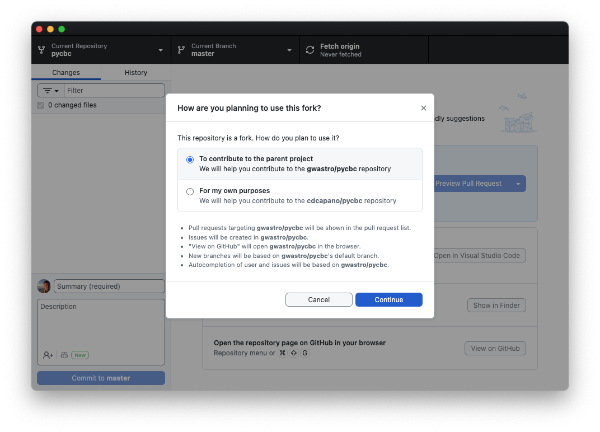

In this exercise you will learn how to collaborate with others using GitHub. You will work with a partner to contribute to the test repository they created on GitHub in [Exercise 2](exercise2.qmd) (and they will do the same with your repository!).

1. Find a partner to work with. Get the web address of the test repository they created in Exercise 2. This is the URL of their repository website. The URL should be something like `https://github.com/THEIR_USERNAME/THEIR_REPO_NAME` where `THEIR_USERNAME` is your partner's GitHub username and `THEIR_REPO_NAME` is the name of the repository they created in Exercise 2. **Again, you are going to the website for your *partner's* repository, not your own.**

2. Click the `Fork` button in the upper right of their website. This will open the "Create a new fork" page.

3. On the "Create a new fork" page:
   - Under "Owner" select **your username**.
   - Leave the repository name the same.
     The Owner / respository name should look like `YOUR_USERNAME / THEIR_REPO_NAME`.

5. Now click the green `Create fork` button in the lower right. This will create a "fork" of your partner's repository under your own GitHub account. You will be redirected to your fork. Note the URL at the top of the webpage: it should be something like `https://github.com/YOUR_USERNAME/THEIR_REPO_NAME`.

::: {.callout-note}
## About forks

A *fork* is a copy of another user's GitHub repository. When you create the fork, you create copy of the repository under your GitHub account. The copy of the repository has the entire commit history of the repository up until that point. It is, for all intents and purposes, an exact replica of the original repository, except that the copy is now under your account.

From this point on, your fork is independent of the original. Since it is under your account, you are free to make any changes that you like to --- add commits or branches, delete things, etc. --- without affecting the original repository. Changes to the original repository also won't affect your fork unless you actively sync it by fetching.

You can create a fork of any public repository on GitHub!

The advantage of using forks is it allows you to develop things without breaking the original repository while you do. This is incredibly useful if you want to contribute to another project that is widely used: you create a fork of that project under your own GitHub account; clone your fork to your local computer; develop your fork by pushing/pulling between your local computer and GitHub. Then, when you are content that your new addition is ready, you fill out a pull request to merge the changes in your fork into the original repository (usually on its `main` branch). The original repo's owner(s) can then review your changes, and, if they accept them, merge it into their repository for widespread adoption. This is known as the [fork and pull model](https://docs.github.com/en/pull-requests/collaborating-with-pull-requests/getting-started/about-collaborative-development-models#fork-and-pull-model).

The diagram below illustrates the relationship between a fork (on GitHub) and a clone:
{width=600}
:::

6. You want to contribute a new development to your partner's repository. To do so, first clone **your fork** of their repository to your local computer:

   a. If you are not already there, go to your fork's website on GitHub. The web address should be something like `https://github.com/YOUR_USERNAME/THEIR_REPO_NAME`.

   b. On your fork's website, click the green `<> Code` button, then "Open with GitHub Desktop" to clone your fork to your computer.

   c. This will open a new window in GitHub Desktop that asks how you're planning to use the fork:

      

   d. Select the "To contribute to the parent project" option then click "Continue".

   ::: {.callout-note}
   ## What's the difference between "To contribute to the parent project" or "For my own purposes"?

   The first option means that when you click buttons like "View on GitHub" you will see  *the original repository* on GitHub, *not* your fork of the repository. Likewise, when you open pull requests through GitHub Desktop, the default will be to open a pull request page on the original repository's main branch, not your fork's main branch.

   In the "for my own purposes" case, clicking "View on GitHub" or opening pull requests will default to viewing / opening PRs on *your fork*.

   In either case, the "origin" repository is *your fork*. This means that when you create a branch and push changes to GitHub, they will go to *your fork*. The options here just relate to what the default action is when viewing on GitHub and opening PRs.

   More often then not, you will want to file Pull Requests and base new branches off of the main branch of the original repository, not your fork. For this reason, we suggest selecting the first option, "To contribute to the parent project." Again, this only affects defaults; you have the same functionality in either case. You can also change this at any time by Repository -> Repository Settings -> Fork Behavior in the menu bar.
   :::

7. Now let's create a branch called `dev2` to add a new feature to the `mymath.R` file. Create the branch on your local computer using GitHub Desktop. (Refer to [Exercise 1](exercise1.qmd) if you forgot how.)

8. Use your text editor to open `mymath.R` and add the following lines to it:

   ```R

   multiply <- function(a, b) {
       return (a*b)
       }
   ```

   Save the changes.

9. Commit your changes using GitHub Desktop.

10. This commit (and the `dev2` branch) currently only exists on your local copy of your fork. To push it to *your fork* on GitHub, click the "Publish branch" button on GitHub Desktop.

11. After you publish the branch, the "Create Pull Request" button will appear in GitHub Desktop. Open a PR by clicking it. (Alternatively, click the View on GitHub button to open the original repository in your web browser. You should see the "Compare & pull request" green button at the top of the website.)

12. Note that in the gray box at the top of the comparing changes page the "base" repository is *your partner's* original repository and the base branch is their `main` branch. This means that you will create a Pull Request on your partner's repository, and that it will be for merging your changes onto their `main` branch. You want that!

13. Fill out the description box if you like and/or change the "Add a title" box. Then click the green `Create pull request` button at the bottom.

14. After you click `Create pull request`, your partner will see a Pull Request pop up on the GitHub website for *their* repository. Have them click on the "Pull Requests" tab at the very top of their website, then click on the pull request.

15. Your partner can review your pull request on their GitHub website. If they are satisfied with it, have them click the green button at the bottom of the page, then `Confirm` (do a Squash and Merge!), to merge the pull request.

Congratulations! You and your partner have now collaborated on a new feature.

16. Once your partner merges the changes, their `main` branch will update with your new commit. The `main` branch of *your* fork will now be out of sync with theirs. To sync it, go to to your GitHub website for your fork (the one with URL `https://github.com/YOUR_USERNAME/THEIR_REPO_NAME`). You should see a gray dialog box at the top that starts with "This branch is 1 commit behind ...". Click the `Sync fork` button, then the green `Update branch` button. This will update your fork's main branch to be the same as your partner's.

17. Update your local copy of your fork. Go to GitHub Desktop and click "Fetch origin". Now switch to your main branch and click "Pull origin" button to pull in the changes.

18. Now that your changes have been merged on to your partner's main branch and you've synced your fork both on GitHub and your computer, you're free to delete your development branch on your computer using GitHub Desktop.
