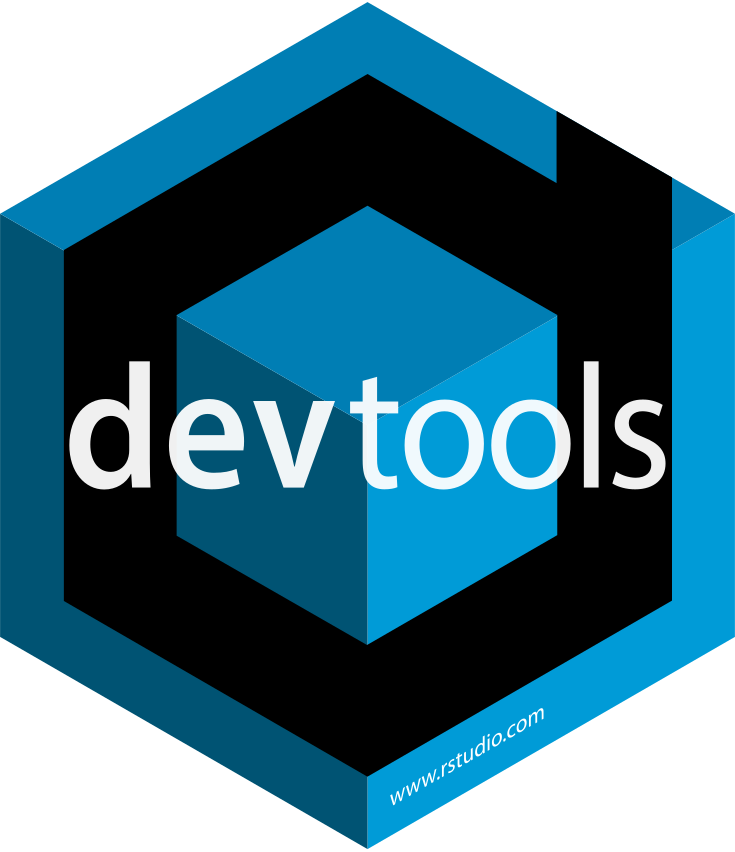

# Should you create a package?

## Pros 

* You want to implement some statistical methods in R

* You want to share some data or functions that you think are useful

## Cons

* Takes some time

* The statistical method may already be implemented (~ *24,000* packages on CRAN)


# The many aspects of package development

Developing an R package covers many aspects. There is an entire book on the topic (available for free [here](https://r-pkgs.org/)).

This module will cover three parts:

1. **Create a package**: implement, document, export, and test functions

2. **Share a package**: put your package on Github, CRAN, make a website
  
3. **Maintain a package**: fix bugs, use Continuous Integration (CI)
  
  

# Create a package

## Structure of a package

At a minimum, a package **must have** two folders:

* `R`: contains all the `.R` files where we will write our functions

* `man`: short for "manual". This will contain all the documentation that is 
accessible with `?` in R (for example `?factor`)

It is recommended to have the following folders:

* `tests`: contains all the tests for your package

* `vignettes`: additional documentation that contains more extensive examples and 
tutorials for your package.


## Practical example

The easiest way to learn how to make a package is to actually make one.

Let's say we want to create a package containing two functions.

1. A function to compute the logarithm that returns `NULL` if the input is not
numeric:

```{r, eval=TRUE, error=TRUE, warning=TRUE}
safe_log <- function(x) {
  if (is.numeric(x)) {
    log(x)
  } else {
    warning("Can't compute the logarithm of a non-numeric input.")
    NULL
  }
}
log("a")
safe_log("a")
```

2. A function to count the number of unique elements in a vector:

```{r, eval=TRUE, error=TRUE}
n_unique <- function(x) {
  length(unique(x))
}
n_unique(1:10)
n_unique(c(1, 1, 2, 3, 4, 4))
```


## Requirements

Our three best friends for this job:

:::: {.columns .center}

::: {.column width="33%"}

<br>
`devtools`
:::

::: {.column width="33%"}

<br>
`usethis`
:::

::: {.column width="33%"}

<br>
`testthat`
:::

::::

<br>

```{r}
# if not already installed
install.packages(c("devtools", "usethis", "testthat"))
```

## Create the package

Create a package called "my.pkg":

* either with `devtools`

```{r}
devtools::create("<path>/my.pkg")
```

* or with RStudio: File > New Project > New Directory > R Package > Name it and choose its location

## How is it organized?

```{.r}
.
├── DESCRIPTION
├── my.pkg.Rproj
├── NAMESPACE
├── R
│   └── hello.R
└── man
    └── hello.Rd
```

We see the two mandatory folders: `R` and `man`.

The `DESCRIPTION` file contains all the important information about our package:

* who built it?
* when?
* what is the goal of the package?
* what are its dependencies?
* what is its license?
* ...

The `NAMESPACE` file contains all the information about the functions that are
imported and exported by our package.

## Add our functions

1. Remove `R/hello.R` and `man/hello.Rd`

2. Create two files in the folder `R`: `n_unique.R` and `safe_log.R`.

3. Paste the functions we created in each of these files.


## Add our functions

Run `devtools::load_all()` in the console.

You should now be able to run our functions in the console!

Next steps: **documenting** and **testing** our functions.


# Document a package

## Document a function

The documentation of a function is done in the `.R` file: it will then automatically be converted to an `.Rd` file placed in the `man` folder. 

There is *no need* to create an `.Rd` file yourself!

Writing the documentation is similar to writing comments, but you need to use
`#'` (with an apostrophe) instead of `#`.

::: {.callout-tip}
To automatically generate the documentation structure for a function, put your 
cursor inside the function, and press:

Ctrl + Alt + Shift + R
:::

```{.r}
#' Title
#'
#' @param x 
#'
#' @return
#' @export
#'
#' @examples
n_unique <- function(x) {
  length(unique(x))
}
```

`@param` is the description of the expected input (there can be several `@param` tags).

`@return` is the description of what this function returns.

`@export` indicates whether this function should be exported, i.e be available to the user of this package.

`@examples` gives some examples that show how the function works.

Let's now run `devtools::document()` to create the `.Rd` file.

You should have this message:
```{.r}
Skipping NAMESPACE
✖ It already exists and was not generated by roxygen2. 
```

Let's delete the file `NAMESPACE` and re-run `devtools::document()`.


You should then be able to access the documentation of our function with `?n_unique`.

:::: {style="text-align: center;"}
TODO: update picture
<!--  -->
::::


We have the minimal documentation but you can make it much bigger:

* You can write a longer description below the title;

* You can write long explanations about a statistical method or other things 
with the tag `@details` after the parameters.

* and [much more...](https://roxygen2.r-lib.org/articles/rd.html)


::: {.callout-warning}
The help page is the first thing users will check to learn about your functions.

Give details and *examples*!
:::


# Test a package

## Test a function

Testing a package is **crucial**.

Having tests reassures:

* the user: it shows that you (the developer) have checked that your function produces
the correct results, at least in basic cases.

* yourself: it ensures you can add functionalities to your package or fix bugs without breaking your existing code.

Testing is made much easier by the package `testthat`^[You might also be interested in [`tinytest`](https://github.com/markvanderloo/tinytest/).].

To start using this package, run:

```{r}
usethis::use_testthat()
```

```{.r}
✔ Setting active project to '/home/etienne/Bureau/Git/misc/my.pkg'
✔ Adding 'testthat' to Suggests field in DESCRIPTION
✔ Setting Config/testthat/edition field in DESCRIPTION to '3'
✔ Creating 'tests/testthat/'
✔ Writing 'tests/testthat.R'
• Call `use_test()` to initialize a basic test file and open it for editing.
```


This created a folder called `tests`:

```{.r}
tests
├── testthat
└── testthat.R
```

We can now add tests files in `tests/testthat`.

Go back to the file `n_unique.R` and run `usethis::use_test()`. This will create a file `test-n_unique.R` containing an example of test.


## Structure of a test

Two main things:

* `test_that()`: contains the title of the test and the code for the test 

* `expect_*()`: the expectations you have for the test.

Example:

```{r}
test_that("n_unique works with all types of vector", {
  expect_equal(
    n_unique(c(1, 2, 3, 1, 3)), # the function we want to test
    3                           # our expectation
  )
  expect_equal(
    n_unique(c("a", "b", "c", "c", "c")),
    3
  )
})
```

Try to make sure your function covers corner cases!

```{r}
test_that("n_unique works with missing values", {
  expect_equal(n_unique(c(NA, 1)), 2)
})

test_that("n_unique works with empty vectors", {
  expect_equal(n_unique(c()), 0)
})
```

There are many helper functions for your expectations:

* `expect_length()`
* `expect_type()`
* `expect_named()`
* `expect_warning()`
* `expect_error()`
* and [more...](https://testthat.r-lib.org/reference/index.html)

## Skip some tests

Some tests shouldn't be run all the time:

* they might depend on another package, so use `skip_if_not_installed()`

```{r}
test_that("n_unique works with dataframes", {
  skip_if_not_installed("dplyr")
  data <- dplyr::band_members
  expect_equal(n_unique(data$band, 2))
})
```

* they might require an Internet connection (e.g if you're building a package wrapping an API), so use `skip_if_offline()`

```{r}
test_that("n_unique works", {
  skip_if_offline()
  expect_equal(n_unique(c(1, 2), 2))
})
```


## Run the tests

Two options:

* `devtools::test()`
* Pane "Build" (next to "Environment", "History", etc.) > button "Test"

```{.r}
ℹ Testing my.pkg
✔ | F W S  OK | Context
✔ |         4 | n_unique                                                                        

══ Results ═════════════════════════════════════════════════════════════════════════════════════
Duration: 0.2 s

[ FAIL 0 | WARN 0 | SKIP 0 | PASS 4 ]
```


## Do you have enough tests?

We now have some tests in our package, but do they cover all function arguments?
All possible use cases?

This is hard to know because users will always find new ~~annoying~~ interesting
bugs.

We can use the package `covr` to see how much of our package is covered by tests:

```{r}
covr::report()
```


## Check a package

We have seen how to run tests, but we can now perform a more thorough check with
`devtools::check()` (or the button "Check" in the "Build" pane).

This will check that:

* you use all of your dependencies

* all of your examples can run

* all your tests pass

* and much more


# Develop a package

We now know the basics of a package: how to create one, document it, and test 
it.

But creating a package is not only that. There are plenty of choices to make,
such as:

* how should I name my functions?

* what dependencies should my package have?


## Namespace

The `NAMESPACE` file contains the list of functions that your package exports.

When someone loads your package with `library(my.pkg)`, all exported functions will be imported in the environment.

In the (very likely) event where this person uses several packages, there can 
be a **namespace conflict** if two packages (or more) provide two functions with the same name.

It is also possible that some of your functions have the same name as 
functions included by default in R.

For example, `dplyr` overwrites several functions:

```{.r}
library(dplyr)

## Attaching package: ‘dplyr’
##
## The following object are masked from ‘package:stats’:
##  
##  filter, lag
##
## The following objects are masked from ‘package:base’:
##   
##  intersect, setdiff, setequal, union
```


While the user has some means to fix such conflicts (e.g see the package
[`conflicted`](https://conflicted.r-lib.org/)), you should do your maximum
to avoid them.

In particular, be very careful that your functions don't have the same names
as other functions in popular packages (e.g `data.table`, `tidyverse`
packages, etc.).

**Advanced:** S3 methods.

Have you ever wondered how `summary()` worked with so many outputs? Or `print()`? Or `plot()`?

`summary()` is an *S3 method* that gets *dispatched* according to the class of
its input.

**EXPLAIN MORE ON S3 METHODS?**


## Dependencies

:::: {style="text-align: center;"}

::::

When you develop your package, you can import other packages, either because 
they provide essential features or simply because they make the development
easier.

However, these dependencies have a **cost**: 

* they make your package more fragile: changes in these dependencies also affect your package;

* they force users to have these dependencies [IS IT REALLY A COST?]


Therefore, you have to find the right balance:

* dependencies are not a bad thing *per se*

* but they increase the maintenance burden and the risk of failure in the 
long run.


This might seem abstract, so let's take an example. Suppose that for one
reason or another, your package uses the function `select_vars()` from the
package `dplyr`. 

This function was removed in `dplyr` v. 1.1.0.

This has implications for the user of your package:

* if their version of `dplyr` is < 1.1.0, it still works fine;

* if their version of `dplyr` is >= 1.1.0, then the function in your package 
that uses `select_vars()` will error.

Having dependencies forces you to stay aware of changes in these dependencies
and this increase the maintenance burden.


# Share a package

Having a package is cool but it's much less useful if you keep it for you^[Although it can be a fine practice.].

There are two main, non-exclusive ways to share your package to the world:

* put it on Github
* put it on CRAN


## Github

Git and Github are useful tools for code sharing, which means they're perfect to
share an R package.

This is *not* a Git tutorial, I'll "just" show how to connect Git and Github to 
RStudio.

If this is already done, skip the next two slides.

1. Download and install [Git](https://git-scm.com/).

2. Connect Git and RStudio: 

    * in RStudio: Tools > Global Options > Git/SVN > Git executable > Browse >
    Find your installation of Git
    
    * it should probably be similar to mine: "C:/Users/etienne/AppData/Local/Programs/Git/bin"
  
3. If necessary, create an account on [Github](github.com/).

4. In RStudio, run `usethis::use_git_config(user.name = "<YOUR NAME>", user.email = "<YOUR EMAIL>")` ^[Note that the email must be the same as the one used to create the Github account.] 

5. Now you need a token that will be stored in RStudio so that Github knows that RStudio has the right to push code to your repositories. You can create one with `usethis::create_github_token()` (you can also change the expiration date).

6. Generate the token and store it in RStudio with `gitcreds::gitcreds_set()`.

7. Restart RStudio.

Doesn't work? More info at [Happy Git with R](https://happygitwithr.com).


## CRAN


:::{style="text-align: center; font-size: 2.3rem"}
CRAN
<br>
<br>
Comprehensive R Archive Network
<br>
<br>
Where packages are stored (around 20,000 packages currently).
:::

Put a package on CRAN:

* Pros:
  * More visibility
  * Package is tested before being uploaded
  * Package is tested with new versions of R or with new versions of its dependencies

* Cons:
  * Delay to fix a bug in your package can be short (2 weeks)
  
CRAN has strict rules in terms of formatting or testing, but that shouldn't worry you:

* there are some collaborative todo lists before submitting to CRAN, such as [this one](https://github.com/ThinkR-open/prepare-for-cran)

* there are a lot of packages to make your life easier ([urlchecker](https://cran.r-project.org/web/packages/urlchecker/index.html), [spelling](https://cran.r-project.org/web/packages/spelling/index.html), etc.)


## Website

We could stop here, but we can add something more: a website!

And no, it won't (or rather shouldn't) take long.

:::: {.columns .center}

::: {.column width="50%"}
We're going to use an amazing package to build a package website in a few minutes: `pkgdown`

:::

::: {.column width="50%"}

:::

::::

```{r}
# if not already installed
install.packages("pkgdown")
```


### Local website

Before putting the website online, we can already create locally with `pkgdown::build_site()`.

This takes care of everything: 

* converting documentation
* create links to the Github repository
* create pages for license, authors, etc.

Once you have a website, you can include it in the `DESCRIPTION` file.


# Advanced

## Github actions


## List of things to be careful

* Check the name of your package: check that there's not already a package with the same name with `available::available()`

* Check the name of your functions: avoid name conflicts with functions from very popular packages

* Reduce the number of dependencies

* **Test your package**

  * explain that CRAN tests the package 1) when you upload a new version, 2) if there's a new version from a dependency
  * linked to the dependencies topic

* If you have a statistical package, get peer-reviewed with [rOpenSci Statistical Software Peer Review](https://ropensci.org/stat-software-review/)
