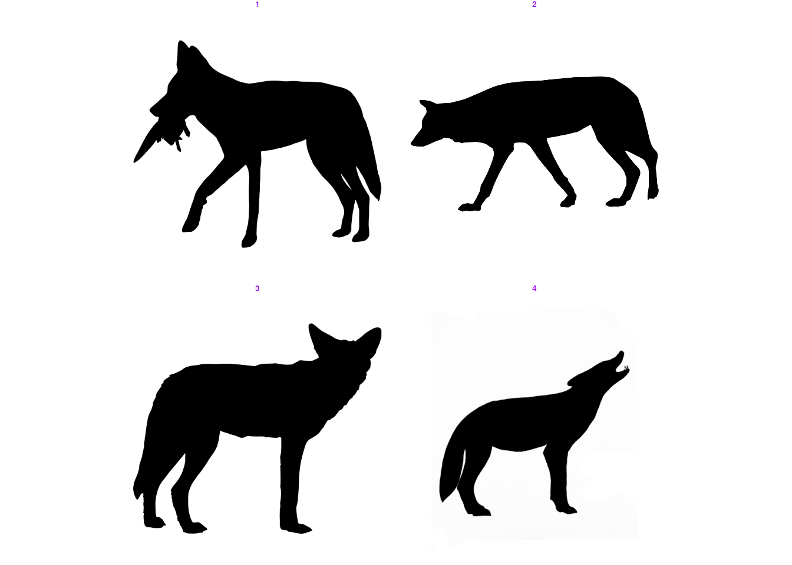
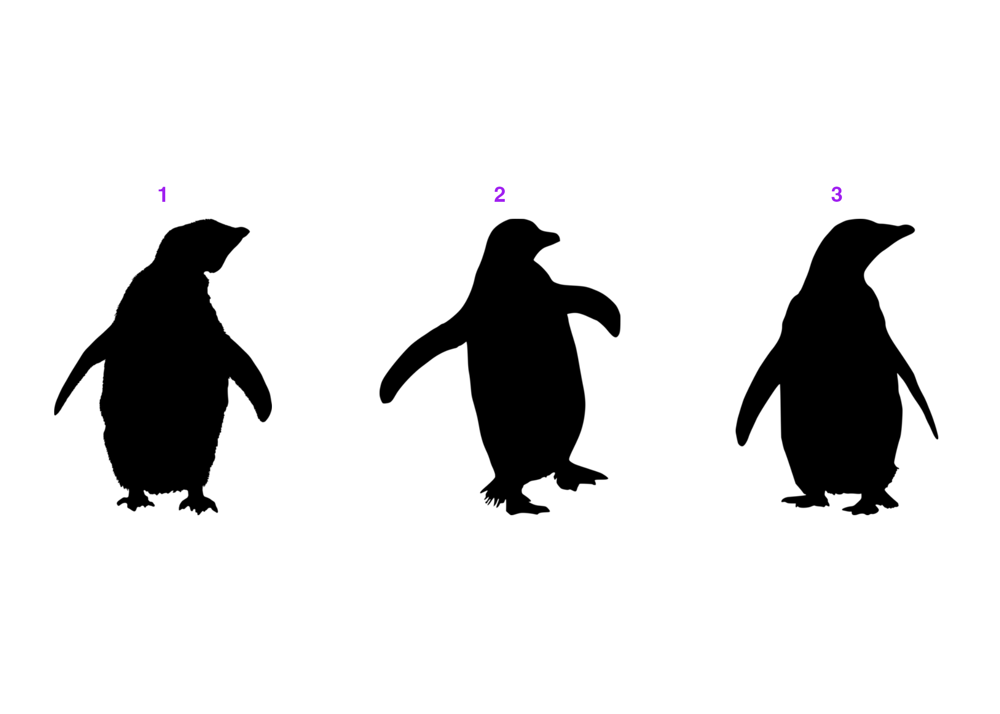

<!-- ENSURE THAT THIS DOCUMENT FOLLOWS THE MODULE STRUCTURE DESCRIBED IN THE GUIDELINES -->
<!-- https://docs.google.com/document/d/16cxSA2bA1MnrnpzmN2yzJNCwJVO7Hm5ceyz10sCmnzY/edit?tab=t.0 -->

::: {.callout}
## Learning Objectives

By the end of this module, you will be able to:

1. Explain what PhyloPic is and how the rphylopic package uses the PhyloPic Application Programming Interface (API) to retrieve silhouettes and their metadata from within R.
2. Search for silhouettes by taxon name and choose between the available options for a given organism.
3. Add silhouettes to plots as layers or as data points in both base R and ggplot2.
4. Transform silhouettes by rotating, flipping, resizing, and recolouring them to suit your figure.
5. Visualise data with silhouettes across a range of plot types, such as x-y plots, maps, phylogenies, and networks.
6. Retrieve attribution and licence information for the silhouettes you use, so that creators are credited appropriately.
7. Save figures containing silhouettes, and export silhouettes as image files.
:::

## Introduction

### What is PhyloPic

::: {.narration}
[**PhyloPic**](https://www.phylopic.org) is an open database of free silhouette images of animals, plants, and other life forms. It's built to illustrate the tree of life. Each silhouette is linked to a node in a taxonomic or phylogenetic hierarchy, so images can be searched by taxon name rather than by keyword alone. Images are contributed by a community of >500 artists and scientists, and each one is released under an open licence (e.g. CC0, CC BY, CC BY-NC). At time of writing, >13,000 silhouette images have been contributed and are available for a broad array of biological groups from dinosaurs and corals to grasses and viruses.
:::

::: {.slides-only}
- **PhyloPic** ([https://www.phylopic.org](https://www.phylopic.org))
- Database of free silhouette images of animals, plants, and other life forms
- +500 contributors
- +13,000 silhouettes
- Open licensing: CC0, CC BY, CC BY-NC, ...
:::

### What is rphylopic

::: {.narration}
[**rphylopic**](https://rphylopic.palaeoverse.org) is an R package that allows users to easily fetch and visualise silhouettes of organisms from PhyloPic. Beyond the website, PhyloPic provides an Application Programming Interface (API), which allows images and their metadata to be queried and retrieved programmatically, and this is what rphylopic builds on. Rather than manually searching the site, downloading files, and importing them into your plotting workflow, you can do all of this from within R. You can look up silhouettes by taxon name, choose between the available options, retrieve their attribution details, and add them to both base R and ggplot2 plots, either as layers or as data points. Silhouettes can also be transformed (e.g. rotated, flipped, resized, and recoloured), and saved as image files. This module will give you an overview of the package and provide example usage.
:::

::: {.slides-only}
**What is it**

- An R package to fetch and visualise organism silhouettes from **PhyloPic**
- Works with both base R and ggplot2

**How it works**

- Builds on the **PhyloPic** API, which lets images and metadata be queried programmatically
- No more manual searching, downloading, and importing: do it all from within R

**Key features**

- Look up silhouettes by taxon name and choose between options
- Retrieve attribution details
- Add silhouettes as layers or data points
- Transform them: rotate, flip, resize, recolour
- Save as image files
:::

### Why use silhouettes

Data visualisation is a key component of any scientific data analysis workflow and is vital for the summarisation and dissemination of complex ideas and results. In ecology and evolutionary biology, data are often associated with taxonomic entities. However, taxonomic nomenclature, which is fundamental to the biological sciences, is often unfamiliar to nonspecialists. Silhouettes act as a compact visual shorthand. In a phylogeny, a diversity-through-time plot, or a multi-panel figure comparing groups, they help readers identify taxa at a glance and reduce the need for long labels. They are also valuable in teaching and outreach materials, where they make otherwise abstract plots more engaging and accessible.

## Getting started

### Installation

The **rphylopic** package can be installed from CRAN (recommended) or its dedicated [GitHub repository](https://github.com/palaeoverse/rphylopic) if the development version is preferred. To install via CRAN, simply use:

```{r}
#| label: install-rphylopic
#| eval: false

install.packages("rphylopic")
```

To install the development version, first install the [remotes](https://remotes.r-lib.org/) package, and then use `install_github()` to install rphylopic directly from GitHub.

```{r}
#| label: install-remotes
#| eval: false

install.packages("remotes")
remotes::install_github("palaeoverse/rphylopic")
```

::: {.callout-note}
Before we get to the good stuff, a quick note on behalf of all developers. Behind every open-source package is a group of people who build, maintain, and support it, often in their own time and often without much recognition. If you use rphylopic in your research, please cite the associated publication. Citations are one of the main ways this kind of work is acknowledged, and they help us keep maintaining and improving the package so that you can keep doing your research ([read more on this topic](https://doi.org/10.1038/s41559-023-02008-w)). You can access the appropriate citation via:

```{r}
#| label: cite-rphylopic
#| eval: false

citation("rphylopic")
```
:::

::: {.callout-important}
Depending on the license, you may be required, by law, to acknowledge the creators of the silhouettes that you use (see [Get attribution](#get-attribution)). Regardless of license, it's generally a good thing to acknowledge people for their contributions.
:::

### How does rphylopic work?

Every silhouette available via [PhyloPic](https://www.phylopic.org) has a universally unique identifier (UUID). The first step to get a PhyloPic silhouette into R is to get a UUID. To do so via rphylopic you can use the `get_uuid()` function to search PhyloPic based on a taxonomic or phylogenetic name (e.g. *Canis lupus*) and return the first matched UUID. Using the returned UUID, you can then fetch the respective silhouette using `get_phylopic()`. However, multiple silhouettes (and hence UUIDs) can exist for a searched name. The `n` argument in `get_uuid()` allows you to fetch `n` matched UUIDs.

### Get a silhouette UUID

```{r}
#| label: get-uuid
#| eval: true

# Load rphylopic
library(rphylopic)
# Get a single image UUID for a species
uuid <- get_uuid(name = "Canis lupus")
# Get the image for that UUID
img <- get_phylopic(uuid = uuid)
# Multiple silhouettes can exist for each species...
uuid <- get_uuid(name = "Canis lupus", n = 5)
```

### Pick a silhouette

As multiple silhouettes can exist for a searched name, it can be difficult to pick the correct UUID, especially without visualising the images. The `pick_phylopic()` function plots all requested silhouettes and provides an interactive menu to allow you to select the right image for you.

```{r}
#| label: pick-silhouette
#| eval: false

# Visualise and pick a PhyloPic
img <- pick_phylopic(name = "Canis lupus", n = 4, view = 4)
```

```{r}
#| echo: false
#| label: wolf-menu


```

Let's go with option 1!

```{r}
#| label: auto-pick-silhouette
#| echo: false
#| eval: true
#| results: false

# DO NOT EXPOSE TO USER THIS IS FOR AUTO-PICKING THE SILHOUETTE
# FROM THE INTERACTIVE MENU
img <- pick_phylopic(name = "Canis lupus", n = 4, view = 4, auto = 1)
```

Now let's inspect the returned object:

```{r}
#| label: print-uuid
#| echo: true
#| eval: true

print(img)
```

We have information about the format (vector), dimensions, the UUID, and the URL of our silhouette.

::: {.callout-caution}
## Exercise 1: Get the UUID of a silhouette for your favourite species

Remember, there may be multiple silhouettes available!

- What is the UUID of your chosen silhouette?
- What is the format of the silhouette?
- What are the dimensions of the silhouette?
:::

### Plot a silhouette

Now we have selected our silhouette, we can start to make some plots!

#### Base R

Let's start with base R by using `add_phylopic_base()`:

```{r}
#| label: plot-base-r
#| eval: true

# OK, now that we've got the image we want... let's add it to a plot!
plot(x = 1, y = 1, type = "n", ann = FALSE)
add_phylopic_base(img = img, x = 0.75, y = 0.75, height = 0.25)

# But can't we just add an image straight away using the UUID? Sure!
uuid <- get_uuid(name = "Canis lupus", n = 1)
add_phylopic_base(uuid = uuid, x = 1, y = 1, height = 0.25)

# What about just using the first image linked to the name? Definitely!
add_phylopic_base(name = "Canis lupus", x = 1.25, y = 1.25, height = 0.25)
```

Ah, you've found out our little secret! You can actually skip the steps of getting the UUID altogether by just searching for the desired taxon in `add_phylopic_base()`. However, this will always return the first matched silhouette meaning you might be missing out on all the other options! It's always worth checking out your options with `pick_phylopic()` first.

::: {.callout-caution}
## Exercise 2: Plot with base R

Using your favourite species, plot a silhouette of it using the three different input argument options (`img`, `uuid`, and `name`) within the same plot.

Are they all the same silhouette? If not, why might that be?
:::

#### ggplot2

You can also accomplish the same plot with the **ggplot2** package. Here, we'll use the `add_phylopic()` function, but the functionality and all of the arguments are equivalent:

```{r}
#| label: plot-ggplot2
#| eval: true

# Load library
library(ggplot2)
# Create plot and add phylopic
p <- ggplot() +
  coord_cartesian(xlim = c(0.6, 1.4), ylim = c(0.6, 1.4)) +
  add_phylopic(img = img, x = 0.75, y = 0.75, height = 0.25)

# But can't we just add an image straight away using the UUID? Sure!
uuid <- get_uuid(name = "Canis lupus", n = 1)
p <- p + add_phylopic(uuid = uuid, x = 1, y = 1, height = 0.25)

# What about just using the first image linked to the name? Definitely!
p + add_phylopic(name = "Canis lupus", x = 1.25, y = 1.25, height = 0.25)
```

::: {.callout-caution}
## Exercise 3: Plot with ggplot2

Using your favourite species, plot a silhouette of it using the three different input argument options (`img`, `uuid`, and `name`) within the same plot.

Are they all the same silhouette? If not, why might that be?
:::

### Transforming silhouettes

Once a silhouette is picked and saved in the your R environment, it may be useful to transform the image to better suit the particular visualisation of interest. Three user-friendly functions are available to accommodate transformations that might be desired: flipping, rotating, and recolouring.

The `flip_phylopic()` function can be used to flip a silhouette horizontally and/or vertically. This may be useful if, for example, you want all of the silhouettes to face the same direction.

```{r}
# Flip silhouette horizontally
img_flip <- flip_phylopic(img = img, horizontal = TRUE, vertical = FALSE)
```

The `rotate_phylopic()` function can be used to rotate a silhouette an arbitrary number of degrees. This may be useful when trying to align a silhouette with text or other objects within a figure.

```{r}
#| label: trans-rotate
#| eval: true

# Rotate silhouette by 45 degrees
img_rot <- rotate_phylopic(img = img, angle = 45)
```

Finally, the `recolor_phylopic()` function can be used to modify the fill color, outline color, and/or transparency of a silhouette. The vast majority of PhyloPic silhouettes are solid black, are fully opaque, and have a transparent outline by default. However, it may be useful to change this when the you are trying to either match an existing visualization color palette or trying to convey extra information, such as categorical data, through color.

```{r}
#| label: trans-recolour
#| eval: true

# Change fill color to blue and transparency to 50%
img_col <- recolor_phylopic(img = img, alpha = 0.5, fill = "blue")
```

Let's see what those look like in the same plot:

```{r}
#| label: trans-all
#| eval: true

ggplot() +
  coord_cartesian(xlim = c(0.6, 1.4), ylim = c(0.6, 1.4)) +
  add_phylopic(img = img_flip, x = 1.25, y = 1.25, height = 0.25) +
  add_phylopic(img = img_rot, x = 1, y = 1, height = 0.25) +
  add_phylopic(img = img_col, x = 0.75, y = 0.75, height = 0.25,
               fill = "original")
```

You'll notice that the rotated silhouette is smaller than the other two silhouettes. This is because we've specifed the `height` of our silhouettes. The width is then automatically set to maintain the original aspect ratio of the silhouette. In this case, the aspect ratio of the rotated silhouette has changed, so the same `height` results in a smaller silhouette overall. If you'd prefer, you could also specify the `width` of the silhouettes.

For convenience, we have also included these transformation options within all of the visualization functions. The default fill is "black", hence why we needed to specify `fill = "original"` above. However, when the same transformed silhouette will be used for multiple visualizations, we suggest transforming the silhouette first, saving it as a new object, then using this new object for visualization purposes.

::: {.callout-caution}
## Exercise 4: Transform your silhouette

It's your turn! After fetching your favourite silhouette (recall: [pick a silhouette](#pick-a-silhouette)), try transforming it by:

- Flipping the silhouette
- Rotating the silhouette
- Recolouring the silhouette

Once you have done that, try visualising them altogether.
:::

### Get attribution

Now that you've made a plot and used some silhouettes, you should acknowledge the contributors that made those silhouettes. To make this easy, rphylopic includes the `get_attribution()` function to get contributor data about specific images:

```{r}
#| label: get-attribution
#| eval: true

# Get valid uuid
uuid <- get_uuid(name = "Nycticebus")
# Get attribution data for uuid
get_attribution(uuid = uuid)
```

However, that's a lot of raw information to handle. With `get_attribution()`, you can also get this output automatically parsed to include in your publications with the `text` argument:

```{r}
#| label: get-attribution-text
#| eval: true

# Get valid uuid
uuid <- get_uuid(name = "Nycticebus")
# Get attribution data for uuid
get_attribution(uuid = uuid, text = TRUE)$text
```

::: {.callout-caution}
## Exercise 5: Get the attribution information

In previous exercises, you selected a silhouette you like. Now, try and get the attribution information for that silhouette.
:::

### Save an image

You should be able to accomplish all of your visualisation needs within R, but in the rare case that you need to use a silhouette outside of R, the `save_phylopic()` function lets you export silhouettes. You can save silhouettes in a range of formats, including: Portable Document Format (PDF), Portable Network Graphics (PNG), Scale Vector Graphics (SVG), Tag Image File Format (TIFF), Joint Photographic Experts Group (JPEG), and bitmap (BMP).

```{r}
#| label: save-image
#| eval: false

# How do I save an image?
# Get image
img <- pick_phylopic(name = "Phascolarctos cinereus", n = 1)
# Save image
save_phylopic(img = img)
```

## Advanced Examples

Herein, we show how rphylopic can be used in more advanced use cases with ggplot2 and base R, including for maps, phylogenies, and network plots. Independent exercises are included along the way so you can get some hands-on practice.

### Basic accession, transformation, and plotting

rphylopic provides robust and flexible tools for accessing and transforming PhyloPic silhouettes. To demonstrate them, we'll use the Antarctic penguin dataset from the [palmerpenguins](https://allisonhorst.github.io/palmerpenguins/) R package.

First, let's load the libraries and the data:

```{r}
#| label: get-penguins

# Load libraries
library(rphylopic)
library(palmerpenguins)
# Get penguin data
data(penguins)
# Subset the data to remove rows with missing sex values
penguins_subset <- subset(penguins, !is.na(sex))
```

Now, let's pick a silhouette to use for the penguins.

```{r}
#| label: pick-penguin
#| eval: false

penguin <- pick_phylopic("Pygoscelis", n = 3, view = 3)
```

```{r}
#| echo: false
#| label: penguin-menu


```

 Let's pick #2:

```{r}
#| label: auto-pick-penguin-silhouette
#| echo: false
#| eval: true
#| results: false

# DO NOT EXPOSE TO USER THIS IS FOR AUTO-PICKING THE SILHOUETTE
# FROM THE INTERACTIVE MENU
penguin <- pick_phylopic("Pygoscelis", n = 2, view = 2, auto = 2)
```

You may have noticed in the preview that the silhouette was a little slanted. Let's rotate it clockwise just a smidgen:

```{r}
#| label: trans-penguin

penguin_rot <- rotate_phylopic(img = penguin, angle = 15)
```

Now, let's draft the plot that we want to make. In this case, let's plot the penguins' bill lengths vs. their flipper lengths, split by species:

::: {.panel-tabset}
### ggplot2

**Tip:** ggplot2's `facet_wrap()` function splits a dataset into multiple panels based on a categorical variable and arranges them in a compact 2D grid.

```{r}
#| label: plot-data-ggplot2

ggplot(penguins_subset) +
  geom_point(aes(x = bill_length_mm, y = flipper_length_mm)) +
  labs(x = "Bill length (mm)", y = "Flipper length (mm)") +
  facet_wrap(~species, ncol = 1) +
  theme_bw(base_size = 15)
```

### Base R

**Tip::** In base R, generating multiple plots means making a separate call to `plot()` for each species. We can avoid repeating ourselves by using a for loop to draw one panel per species, after setting up a three-row layout with `par()`.

```{r}
#| label: plot-data-base

# Calculate shared axis limits so all panels are comparable
xlim <- range(penguins_subset$bill_length_mm)
ylim <- range(penguins_subset$flipper_length_mm)

# Set up the plot area (3 rows, 1 column)
par(mfrow = c(3, 1), mar = c(4, 4, 2, 1))

# Loop over the species and create a plot for each one
for (sp in levels(penguins_subset$species)) {
  # Subset the data to the current species and plot it
  with(
    subset(penguins_subset, species == sp),
    plot(bill_length_mm, flipper_length_mm,
         xlim = xlim, ylim = ylim,
         xlab = "Bill length (mm)", ylab = "Flipper length (mm)",
         main = sp)
  )
}
```
:::

That's not a bad basic plot, but we can make it nicer by adding a penguin silhouette. Sadly, we don't have a separate silhouette for each species ([although we could make one...](https://contribute.phylopic.org)), so we'll place a single silhouette in the top panel using the `geom_phylopic` (ggplot2) and `add_phylopic_base()` (base R) functions. Note that the x and y arguments specify the centre of the silhouette, and the height argument specifies how tall it is, in the units of the y-axis.

::: {.panel-tabset}
### ggplot2

```{r}
#| label: plot-penguin-ggplot2

# Create object for plotting penguin
silhouette_df <- data.frame(x = 59, y = 215, species = "Adelie")

ggplot(penguins_subset) +
  geom_point(aes(x = bill_length_mm, y = flipper_length_mm)) +
  geom_phylopic(data = silhouette_df, aes(x = x, y = y), height = 30,
                img = penguin_rot) +
  labs(x = "Bill length (mm)", y = "Flipper length (mm)") +
  facet_wrap(~species, ncol = 1) +
  theme_bw(base_size = 15)
```

### Base R

```{r}
#| label: plot-penguin-base

# Set up the plot area (3 rows, 1 column)
par(mfrow = c(3, 1), mar = c(4, 4, 2, 1))

# Loop over the species and create a plot for each one
for (sp in levels(penguins_subset$species)) {
  # Subset the data to the current species and plot it
  with(
    subset(penguins_subset, species == sp),
    plot(bill_length_mm, flipper_length_mm,
         xlim = xlim, ylim = ylim,
         xlab = "Bill length (mm)", ylab = "Flipper length (mm)",
         main = sp)
  )

  # Add the silhouette to the top panel only
  if (sp == levels(penguins_subset$species)[1]) {
    add_phylopic_base(img = penguin_rot, x = 59, y = 215, height = 30)
  }
}
```
:::

Isn't that nifty! But we can go a step further: what if we used little penguins instead of points? We can do this with `geom_phylopic()` (ggplot2) and `add_phylopic_base()` (base R). Since we want the same image for every x-y pair, we can specify `img = penguin_rot` once more:

::: {.panel-tabset}
### ggplot2

```{r}
#| label: plot-penguin-points-ggplot2

ggplot(penguins_subset) +
  geom_phylopic(img = penguin_rot,
                aes(x = bill_length_mm, y = flipper_length_mm)) +
  labs(x = "Bill length (mm)", y = "Flipper length (mm)") +
  facet_wrap(~species, ncol = 1) +
  theme_bw(base_size = 15)
```

### Base R

```{r}
#| label: plot-penguin-points-base

# Set up the plot area (3 rows, 1 column)
par(mfrow = c(3, 1), mar = c(4, 4, 2, 1))

# Loop over the species and create a plot for each one
for (sp in levels(penguins_subset$species)) {
  # Subset the data to the current species
  species_data <- subset(penguins_subset, species == sp)

  # Create an empty plot with the shared axis limits
  plot(NA, xlim = xlim, ylim = ylim,
       xlab = "Bill length (mm)", ylab = "Flipper length (mm)",
       main = sp)

  # Add a penguin silhouette at each x-y pair instead of a point
  add_phylopic_base(img = penguin_rot,
                    x = species_data$bill_length_mm,
                    y = species_data$flipper_length_mm)
}
```
:::

Oh no, the silhouettes are way too big! By default, `geom_phylopic()` and `add_phylopic_base()` makes each silhouette as tall as the plot, which is far too large here. Instead, we can specify a height or width to use (in y-axis or x-axis units, respectively):

::: {.panel-tabset}
### ggplot2

```{r}
#| label: plot-penguin-height-ggplot2

ggplot(penguins_subset) +
  geom_phylopic(img = penguin_rot,
                aes(x = bill_length_mm, y = flipper_length_mm), 
                height = 5) +
  labs(x = "Bill length (mm)", y = "Flipper length (mm)") +
  facet_wrap(~species, ncol = 1) +
  theme_bw(base_size = 15)
```

### Base R

```{r}
#| label: plot-penguin-height-base

# Set up the plot area (3 rows, 1 column)
par(mfrow = c(3, 1), mar = c(4, 4, 2, 1))

# Loop over the species and create a plot for each one
for (sp in levels(penguins_subset$species)) {
  # Subset the data to the current species
  species_data <- subset(penguins_subset, species == sp)

  # Create an empty plot with the shared axis limits
  plot(NA, xlim = xlim, ylim = ylim,
       xlab = "Bill length (mm)", ylab = "Flipper length (mm)",
       main = sp)

  # Add a penguin silhouette at each x-y pair instead of a point
  add_phylopic_base(img = penguin_rot,
                    x = species_data$bill_length_mm,
                    y = species_data$flipper_length_mm,
                    height = 5)
}
```
:::

::: {.callout-caution}
## Exercise 6: Vary silhouette height with data

So far we have set the silhouette size by hand. Instead, we can map the height to another variable in our data, and rphylopic will scale the values for us automatically.

**Your task:** Make a plot with the size of the silhouettes relative to the penguins' body masses (`body_mass_g`).
:::

::: {.callout-tip collapse="true"}
## Exercise 6: Solution

::::: {.panel-tabset}
### ggplot2

With `geom_phylopic()`, rphylopic automatically rescales values between 1 and 6. So, we can just pass `height = body_mass_g`.

**Hint:** If the defaults don't suit your data, you can also adjust the scaling with `scale_height_continuous()` (or `scale_width_continuous()` for the width aesthetic), used just like `scale_size_continuous()`. We'll use the defaults here:

```{r}
#| label: plot-penguin-scale-ggplot2

ggplot(penguins_subset) +
  geom_phylopic(img = penguin_rot, 
                aes(x = bill_length_mm, y = flipper_length_mm, height = body_mass_g)) +
  labs(x = "Bill length (mm)", y = "Flipper length (mm)") +
  facet_wrap(~species, ncol = 1) +
  theme_bw(base_size = 15)
```

### Base R

With `add_phylopic_base()`, rphylopic does not automatically rescale values. So, we have to manually adjust our scaling. Here, we use `height = log10(body_mass_g)`.

```{r}
#| label: plot-penguin-scale-base

# Set up the plot area (3 rows, 1 column)
par(mfrow = c(3, 1), mar = c(4, 4, 2, 1))

# Loop over the species and create a plot for each one
for (sp in levels(penguins_subset$species)) {
  # Subset the data to the current species
  species_data <- subset(penguins_subset, species == sp)

  # Create an empty plot with the shared axis limits
  plot(NA, xlim = xlim, ylim = ylim,
       xlab = "Bill length (mm)", ylab = "Flipper length (mm)",
       main = sp)

  # Add a penguin silhouette at each x-y pair instead of a point
  add_phylopic_base(img = penguin_rot,
                    x = species_data$bill_length_mm,
                    y = species_data$flipper_length_mm,
                    # Manually scale with log10
                    height = log10(species_data$body_mass_g))
}
```
:::::
:::

::: {.callout-caution}
## Exercise 7: Define fill colours with data

**Your task:** Now that you've varied the size of the penguins based on their body mass, make a plot where you also vary the colour fill of penguins based on their `sex`.
:::

::: {.callout-tip collapse="true"}
## Exercise 7: Solution

::::: {.panel-tabset}
### ggplot2

**Tip:** the default for `geom_phylopic()` is to not display a legend, so we need to set `show.legend = TRUE`. However, we only want a legend for the fill colours, so we use `guide = "none"` for the size scale. We also want to show the fill color in the legend, so we need to override the shape:

```{r}
#| label: plot-penguin-colour-ggplot2

ggplot(penguins_subset) +
  geom_phylopic(img = penguin_rot,
                aes(x = bill_length_mm, y = flipper_length_mm,
                    height = body_mass_g, fill = sex),
                show.legend = TRUE) +
  labs(x = "Bill length (mm)", y = "Flipper length (mm)") +
  scale_size_continuous(guide = "none") +
  scale_fill_manual("Sex", values = c("orange", "blue"),
                    labels = c("Female", "Male"),
                    guide = guide_legend(override.aes = list(shape = 21))) +
  facet_wrap(~species, ncol = 1) +
  theme_bw(base_size = 15) +
  theme(legend.position = "inside", legend.position.inside = c(0.9, 0.9))
```

### Base R

**Tip:** By default base `plot()` does not add a legend to a plot. We need to define it using `legend()`.

```{r}
#| label: plot-penguin-colour-base

# Set up the plot area (3 rows, 1 column)
par(mfrow = c(3, 1), mar = c(4, 4, 2, 1))

# Loop over the species and create a plot for each one
for (sp in levels(penguins_subset$species)) {
  # Subset the data to the current species
  species_data <- subset(penguins_subset, species == sp)

  # Create an empty plot with the shared axis limits
  plot(NA, xlim = xlim, ylim = ylim,
       xlab = "Bill length (mm)", ylab = "Flipper length (mm)",
       main = sp)

  # Add a penguin silhouette at each x-y pair instead of a point
  add_phylopic_base(img = penguin_rot,
                    x = species_data$bill_length_mm,
                    y = species_data$flipper_length_mm,
                    # Manually scale with log10
                    height = log10(species_data$body_mass_g),
                    # Set fill colour
                    fill = ifelse(species_data$sex == "male", "blue", "orange"))
}

# Add a legend
legend("bottomright", legend = c("Female", "Male"), pch = 20,
       col = c("orange", "blue"), bty = "n")
```
:::::
:::

### Geographic distribution

In much the same way as generic x-y plotting, the rphylopic package can be used in combination with ggplot2 to plot organism silhouettes on a map. That is, to plot data points (e.g. species occurrences) as silhouettes. We provide an example here of how this might be achieved. For this application, we use the example occurrence dataset of early (Carboniferous to Early Triassic) tetrapods from the palaeoverse R package to visualize the geographic distribution of Diplocaulus fossils.

First, let’s load our libraries and the tetrapod data:

```{r}
#| label: load-library-geo

# Load libraries
library(rphylopic)
library(ggplot2)
library(palaeoverse)
library(sf)
library(rnaturalearth)
# Get occurrence data
data(tetrapods)
```

Then we’ll subset our occurrences to only those for Diplocaulus:

```{r}
#| label: subset-tetrapods

diplocaulus <- subset(tetrapods, genus == "Diplocaulus")
```

**TODO: WALKTHROUGH ON GEOGRAPHIC PLOTTING** 

```{r}
#| label: map-setup

# Get map data
world <- ne_countries(returnclass = "sf")

# Convert tetrapods to sf object
diplocaulus <- diplocaulus |>
  st_as_sf(coords = c("lng", "lat"), crs = 4326)
```

Now, let’s plot those occurrences on a world map. ggplot2 and it’s built-in function map_data() make this a breeze. Note that we use alpha = 0.75 in case there are multiple occurrences in the same place. That way, the darker the fill color, the more occurrences in that geographic location.

::: {.panel-tabset}
### ggplot2

```{r}
#| label: plot-map-ggplot2

# Plot
ggplot(world) +
  geom_sf(fill = "lightgray", color = "darkgrey", linewidth = 0.1) +
  geom_sf(data = diplocaulus, size = 0.75, alpha = 0.75, colour = "blue") +
  theme_void() +
  coord_sf()
```

### Base R

```{r}
#| label: plot-map-base

# Define margins
par(mar = c(1, 1, 1, 1))
# Plot
plot(st_geometry(world), col = "lightgrey", border = "darkgrey", lwd = 0.1)
plot(st_geometry(diplocaulus), cex = 0.75, pch = 16, 
     col = rgb(red = 0, green = 0, blue = 1, alpha = 0.75),
     add = TRUE)
```

:::

Now, as with the penguin figure above, we can easily replace those points with silhouettes.

::: {.panel-tabset}
### ggplot2

```{r}
#| label: plot-map-silhouettes-ggplot2

ggplot(world) +
  geom_sf(fill = "lightgray", color = "darkgrey", linewidth = 0.1) +
  geom_phylopic(data = diplocaulus, 
                aes(x = st_coordinates(diplocaulus)[ ,1], 
                    y = st_coordinates(diplocaulus)[ ,2], 
                    name = genus),
                height = 4, alpha = 0.75, fill = "blue") +
  theme_void() +
  coord_sf()
```

### Base R

```{r}
#| label: plot-map-silhouettes-base

# Plot map
plot(world, col = "lightgrey", border = "darkgrey", lwd = 0.1, main = NA)
# Plot silhouettes
add_phylopic_base(name = diplocaulus$genus,
                  x = st_coordinates(diplocaulus)[ ,1], 
                  y = st_coordinates(diplocaulus)[ ,2],
                  height = 4, fill = "blue", alpha = 0.75)
```

:::

Snazzy!

Note that while we used the genus name as the name aesthetic here, we easily could have done name = "Diplocaulus" outside of the aes() call instead. However, if we were plotting occurrences of multiple genera, we’d definitely want to plot them as different silhouettes using name = genus within the aes() call.

Also, note that we could change the projection of the map and data using the crs and default_crs arguments in coord_sf(). When projecting data, note that the y-axis limits will change to projected limits. For example, in the Robinson projection, the y-axis limits are roughly -8,600,000 and 8,600,000 in projected coordinates. Therefore, you may need to adjust the height argument/aesthetic accordingly when projecting maps and data.

::: {.panel-tabset}
### ggplot2

```{r}
#| label: plot-map-coord-ggplot2

# Target projection (Robinson)
crs_rob <- st_crs("ESRI:54030")

# Set up a bounding box
bbox <- st_graticule(crs = 4326, 
                     lat = c(-89.9, 89.9), 
                     lon = c(-179.9, 179.9)) |>
          st_transform(crs_rob)

# Project world
proj_world <- world |>
  st_transform(crs_rob)

# Project lng/lat (WGS84) to Robinson
proj_diplocaulus <- diplocaulus |>
  st_transform(crs_rob)

ggplot(proj_world) +
  geom_sf(fill = "lightgray", color = "darkgrey", linewidth = 0.1) +
  geom_phylopic(data = proj_diplocaulus,
                aes(x = st_coordinates(proj_diplocaulus)[ ,1], 
                    y = st_coordinates(proj_diplocaulus)[ ,2], 
                    name = genus),
                height = 8E5, alpha = 0.75, fill = "blue") +
  geom_sf(data = bbox) +
  theme_void() +
  coord_sf()
```

### Base R

```{r}
#| label: plot-map-coord-base

# Target projection (Robinson)
crs_rob <- st_crs("ESRI:54030")
# Set up a bounding box
bbox <- st_graticule(crs = 4326, 
                     lat = c(-89.9, 89.9), 
                     lon = c(-179.9, 179.9)) |>
          st_transform(crs_rob)
# Project world
proj_world <- world |>
  st_transform(crs_rob)
# Project lng/lat (WGS84) to Robinson
proj_diplocaulus <- diplocaulus |>
  st_transform(crs_rob)
# Plotting
par(mar = c(0, 0, 0, 0))
# Map
plot(st_geometry(proj_world), col = "lightgrey", border = "darkgrey", lwd = 0.1)
# Bounding box
plot(st_geometry(bbox), col = "black", add = TRUE)
# Draw silhouettes (height is in projected units, i.e. metres)
add_phylopic_base(name = proj_diplocaulus$genus,
                  x = st_coordinates(proj_diplocaulus)[ ,1], 
                  y = st_coordinates(proj_diplocaulus)[ ,2], 
                  height = 8E5, fill = "blue", alpha = 0.75)
```

:::

### Phylogenetics

### Network plots
